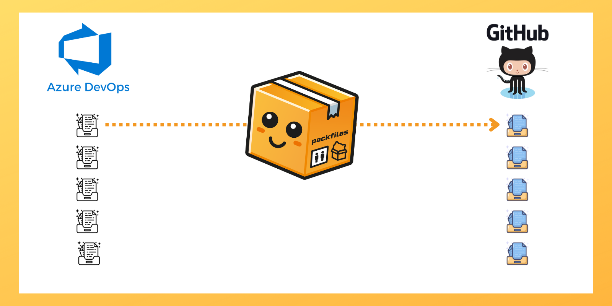

# Quickstart

This Quickstart will guide you through the process of migrating repositories to GitHub using Warp. You’ll create a new project, set up your Vault, connect your source and GitHub organizations to Warp, and then migrate a repository to GitHub.

<figure><figcaption>
Warp simplifies and accelerates configuration management and migrations to GitHub.
</figcaption></figure>

In this Quickstart, you will:

* Install the prerequisites.
* Create a new project to migrate repositories to GitHub.
* Gather the necessary credentials for a migration.
* Set up a vault to securely store the credentials and a vault key to unlock them.
* Scan the source for repositories.
* Migrate a repository from Azure DevOps to GitHub.
