# Quickstart

This Quickstart will guide you through the process of migrating repositories from Azure DevOps to GitHub using Warp. You’ll create a new project, set up your Vault, connect your Azure DevOps and GitHub organizations to Warp, and migrate a repository from Azure DevOps to GitHub.


In this Quickstart, you will:

* Install the prerequisites
* Create a new project to migrate repositories from Azure DevOps to GitHub
* Get personal access tokens for Azure DevOps and GitHub
* Set up a vault to securely store the personal access tokens and a vault key to unlock them
* Connect Azure DevOps to Warp
* Migrate a repository from Azure DevOps to GitHub



### 1. Confirm That You Have the Prerequisites

**Before you can start migrating repositories from Azure DevOps to GitHub, confirm that the prerequisite applications are installed on your local computer.**&#x20;

They are:

1. **GitHub CLI (command-line interface) application**. Even if you have the GitHub desktop application installed, you’ll need the GitHub CLI to use the Warp command-line extension.
2. **Warp command-line extension**. This utility assembles the secure vault file containing tokens authorizing access to your source and destination repositories, generates the key to unlock the vault file, and puts both in your _Migration HQ_ repository.

🛠️ **If you already have these prerequisites installed,** proceed to the next section, _Create a New Project_.

🛠️ **If you&#x20;**_**don’t**_**&#x20;have these prerequisites installed,** follow the steps in [_Installing the Prerequisites_](install-the-prerequisites.md)_._

### 2. Create a New Project

**The next step is to create a&#x20;**_**Project.**_&#x20;

In Warp, a Project is an object for managing the migration of repositories to GitHub. Typically, you’ll create a new project for a specific _migration engagement_, such as moving a collection of repositories for your own organization or for a client.

You’ll use the Warp web application to create the project.

<figure>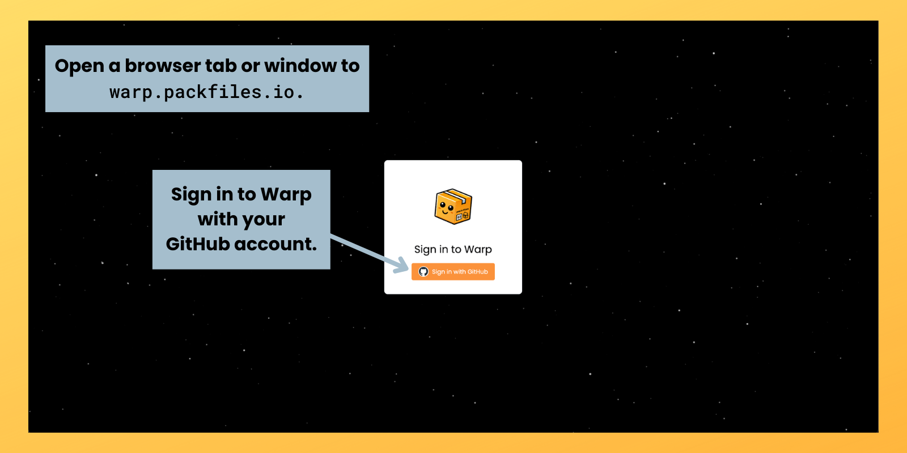<figcaption><p>Warp’s sign in page, located at <a href="https://warp.packfiles.io/">warp.packfiles.io</a>.</p></figcaption></figure>

🛠️ Open a browser tab or window to the [Warp web application](https://warp.packfiles.io) at [warp.packfiles.io](https://warp.packfiles.io).

🛠️ Click the **Sign in with GitHub** button and sign in to Warp using your GitHub account.

You will be taken to the _Projects_ page, which lists the current migration projects. At the bottom of the list of projects, you’ll see the **Create a New Project** link.

<figure>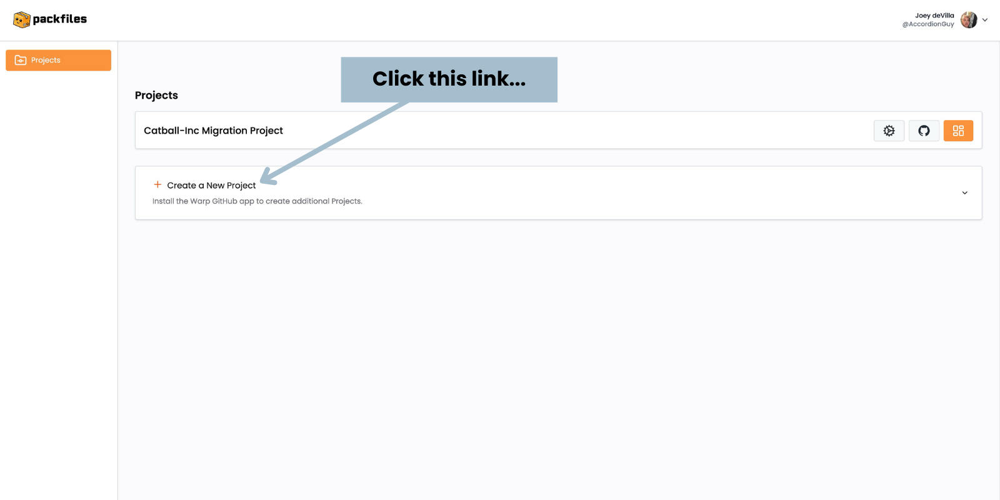<figcaption><p>Warp’s <em>Projects</em> page, which you’ll see immediately after signing in.</p></figcaption></figure>

🛠️ Click the **Create a New Project** link.

A new section will appear below the link. This section provides instructions for what to do next, which is to install the Warp GitHub app into the GitHub organization where you will migrate your repositories:

<figure>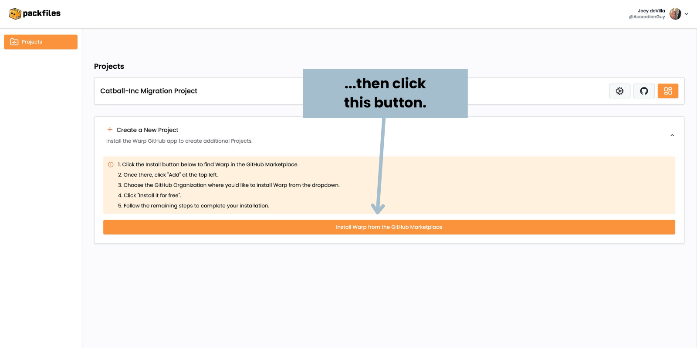<figcaption><p>Creating a new project in Warp.</p></figcaption></figure>

🛠️ Click the **Install Warp from the GitHub Marketplace** link.

You will arrive at the page for the Warp GitHub app:

<figure>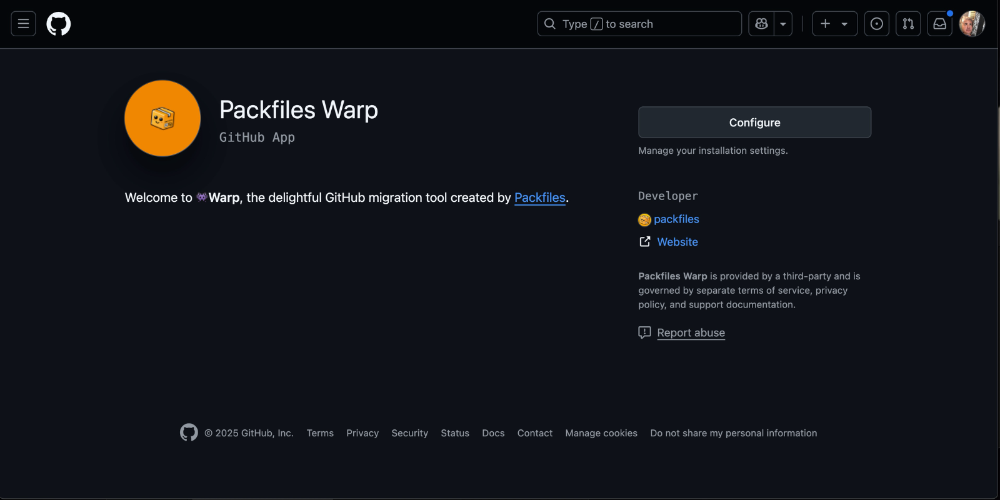<figcaption><p>Click <strong>Configure</strong> on this page to install the Warp GitHub app.</p></figcaption></figure>

🛠️ Click the **Configure** button to install Warp.

You will be shown a list of user and organization accounts where you can install Warp: You will be shown a list of user and organization accounts where you can install Warp:

<figure>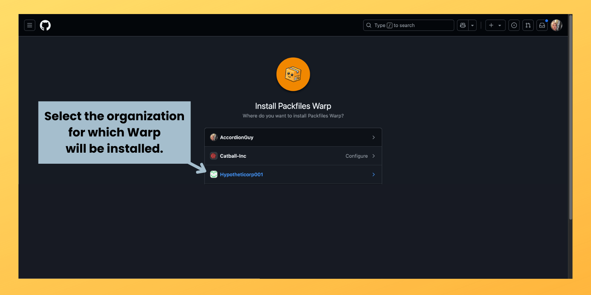<figcaption><p>You’ll install the Warp GitHub app in the destination GitHub organization.</p></figcaption></figure>

🛠️ Select the organization account where Warp will be installed. This should be the organization where you’ll migrate the repositories _to_. In this example, the organization is **Hypotheticorp5678**. 🛠️ Select the organization account where Warp will be installed. This should be the organization where you’ll migrate the repositories _to_. In this example, the organization is **Hypotheticorp5678**.

After you select the organization, you will go to a page showing which repositories the Warp GitHub app will have access to (all of them) and what it will have read, write, and admin access to.

<figure>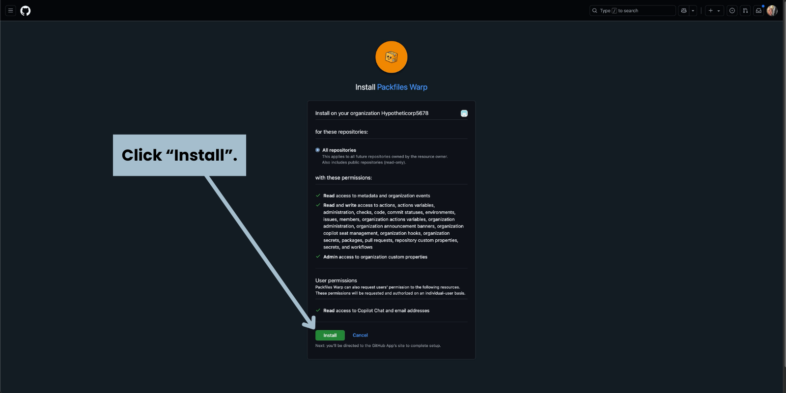<figcaption><p>The final page for the process of installing the GitHub Wap app.</p></figcaption></figure>

🛠️ Click the **Install** button.

You should automatically return to the _Projects_ page in the Warp web application:

<figure>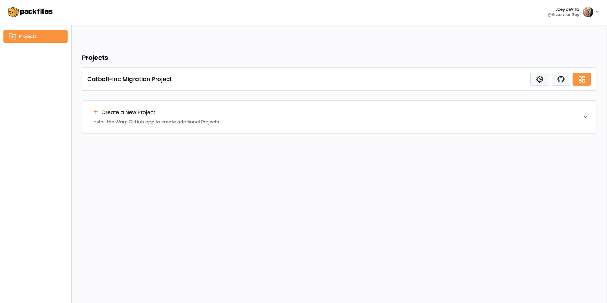<figcaption><p>After installing the Warp GitHub app, you’ll be returned to the <em>Projects</em> page.</p></figcaption></figure>

🛠️ Click your browser’s **Reload** button.&#x20;

You should arrive at the _Welcome to Warp_ page:

<figure>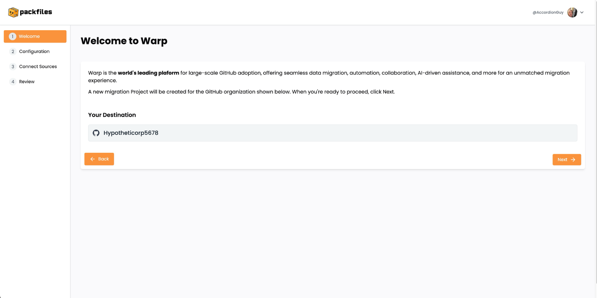<figcaption><p>The <em>Welcome to Warp</em> page.</p></figcaption></figure>

🛠️ Click the **Next** button.

This will take to you the _Configure Your Project_ page. You can do two things on this page:

1. You can set the name of your project, or choose to keep the default name.
2. You can invite people on your team to become members of the project. This will take to you the _Configure Your Project_ page. You can do two things on this page:
3. You can set the name of your project, or choose to keep the default name.
4. You can invite people on your team to become members of the project.

<figure>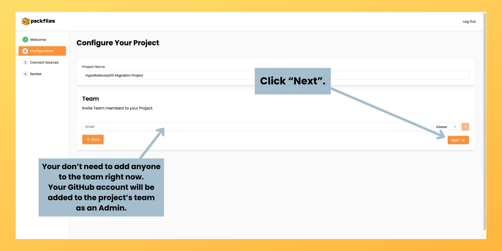<figcaption><p>The <em>Configure Your Project</em> page.</p></figcaption></figure>

🛠️ For this quickstart, simply click the **Next** button.

ℹ️ As the creator of the project, you don’t have to add yourself to the team. You are already a member of the project with _Admin_ access.

The next page to appear is the _Connect Your Sources_ page. You’ll use it in the process of connecting your Azure DevOps and GitHub accounts to Warp.

<figure>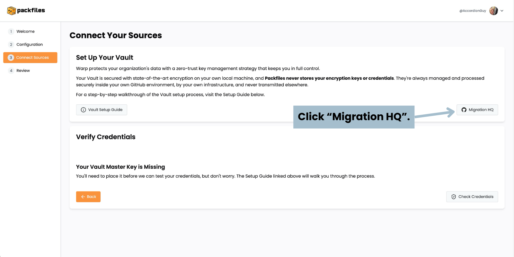<figcaption><p>The <em>Connect Your Sources</em> page.</p></figcaption></figure>

When you created the project, Warp created a repository named _Migration HQ_ for the GitHub organization that you selected earlier. This repository will be the user interface for managing your migrations.

Your next task is to clone the repository to your local computer. You will then create a file containing your authorizations to access both your Azure DevOps organization and GitHub account, which Warp will use to migrate your repositories. Warp will then add that file to the local repository and push it to _Migration HQ_.

🛠️ Let’s visit _Migration HQ_. Click the **Migration HQ** button.

You will be taken to the _Migration HQ_ page:

<figure>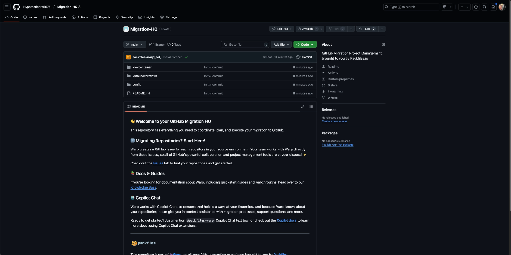<figcaption><p>Your project’s <em>Migration HQ</em> page in GitHub.</p></figcaption></figure>

🛠️ Clone the _Migration HQ_ repository to your local computer.

### 3. Generate Personal Access Tokens (PATs)

In order to migrate repositories from Azure DevOps to GitHub, you need to provide Warp with authorizations to access:

1. The Azure DevOps organization that contains the repositories you want to migrate, and
2. Your GitHub account.

You do this by generating Personal Access Tokens (PATs) for both of the above. Warp will use the authorization that these tokens provide to access the repositories in the Azure DevOps organization and migrate them to the destination GitHub organization.

#### 3a. Generate a PAT for Your Azure DevOps Organization

First, let’s generate a PAT for the Azure DevOps organization whose repositories will be migrated.

<figure>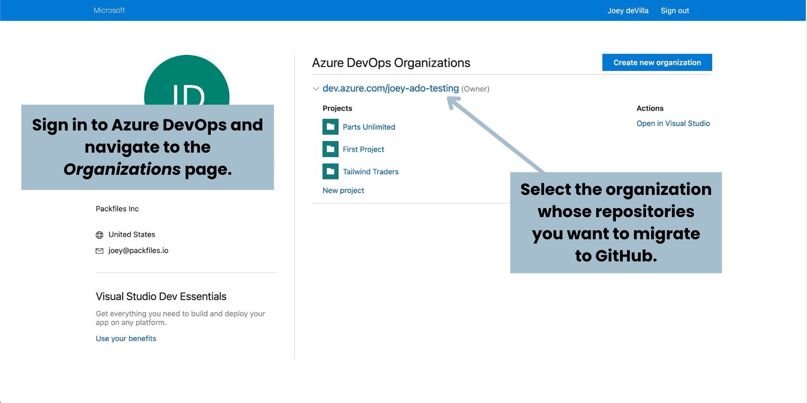<figcaption><p>The Azure DevOps <em>Organizations</em> page.</p></figcaption></figure>

🛠️ Sign in to Azure DevOps and navigate to the _Organizations_ page. On that page, select the organization whose repositories you want to migrate to GitHub.

You will arrive at the page for the organization you selected. You will arrive at the page for the organization you selected.

<figure>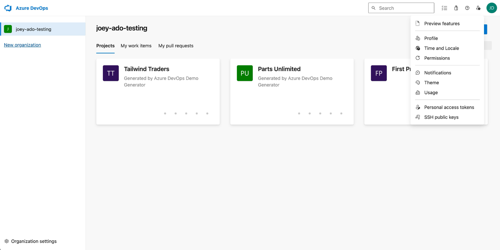<figcaption><p>The page for a specific organization in Azure DevOps.</p></figcaption></figure>

Later in this process, you’ll be asked to provide the _slug_ for the Azure DevOps organization you want to connect to Warp. The slug is the part of the URL for the Azure DevOps organization that uniquely identifies the organization. For example:

<figure>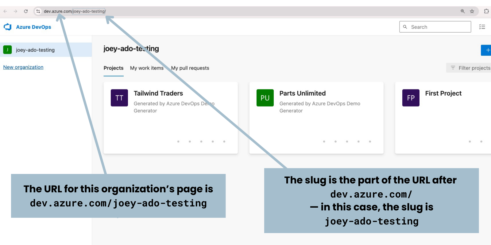<figcaption><p>How to get the slug for your Azure DevOps organization.</p></figcaption></figure>

In the example above, the URL for the Azure DevOps organization’s page is `dev.azure.com/joey-ado-testing`, which means the slug is `joey-ado-testing`.

🛠️ Copy the slug for the Azure DevOps organization for later use.

<figure>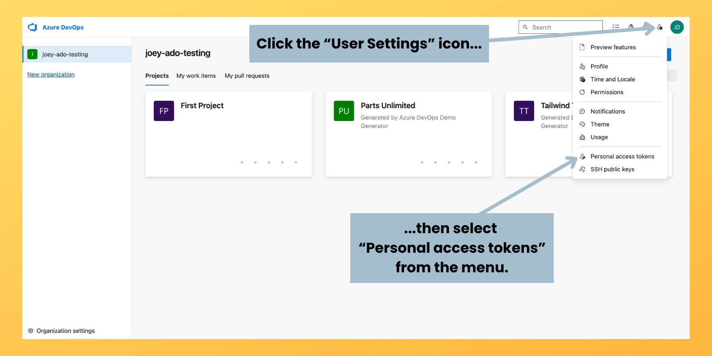<figcaption><p>How to get to the <em>Personal Access Tokens</em> page.</p></figcaption></figure>

🛠️ Click on the _User Settings_ icon (it looks like a person with a gear) near the top right corner of the page. Select **Personal access tokens** from the menu that appears.

You will see the _Personal Access Tokens_ page:

<figure>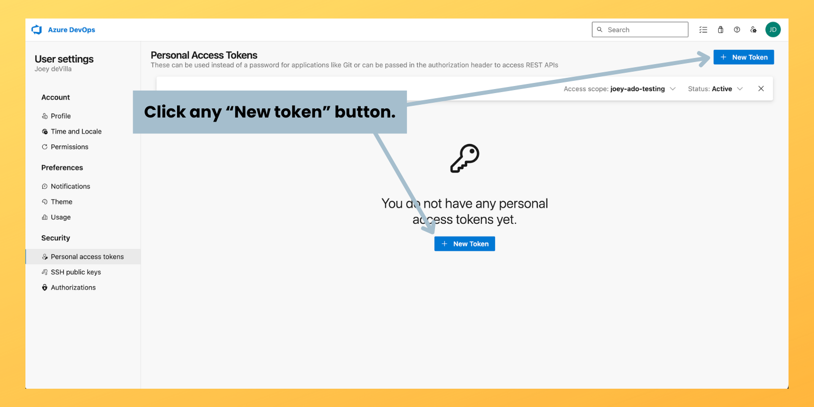<figcaption><p>The <em>Personal Access Tokens</em> page.</p></figcaption></figure>

🛠️ Click any of the **New Token** buttons on the page.

A panel will appear, prompting you to create a new personal access token:

<figure>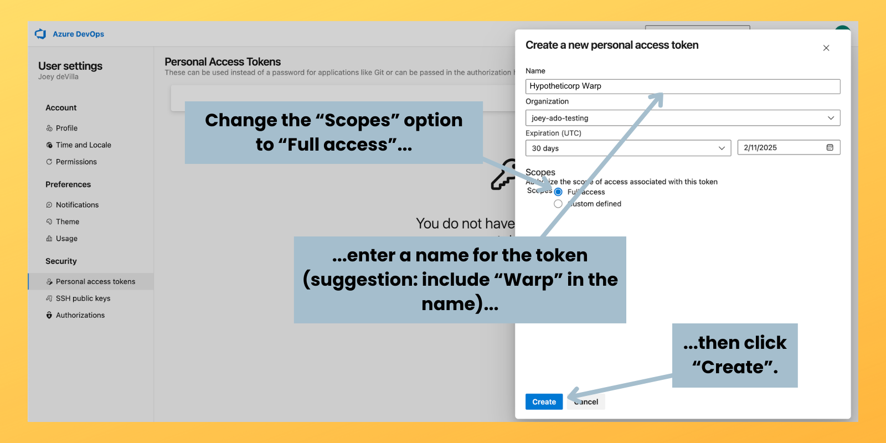<figcaption><p>Creating a new personal access token for your Azure DevOps organization.</p></figcaption></figure>

🛠️ In the **Name** field, enter a name for the token. To make it easier to identify, we suggest you include “Warp” in the name.

🛠️ Under **Scopes**, change the option to **Full access**.

ℹ️ For the purposes of this Quickstart, we’ll leave the **Expiration** field at the default value of 30 days.

🛠️ Click the **Create** button.

You should now see the _Success!_ panel, which will display the personal access token you just created:

<figure>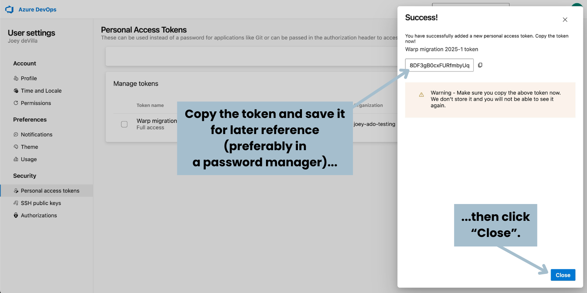<figcaption><p>Getting your personal access token. This is the only time Azure DevOps will present it!</p></figcaption></figure>

🛠️ Copy the token and **save it in a safe place** — preferably a password manager. Warp needs this token to migrate the repositories from the Azure DevOps organization to GitHub.

This will be your only time that this personal access token will be presented to you. Make sure you’ve copied it someplace safe before clicking the **Close** button!

🛠️ Click the **Close** button.

When you close the _Success!_ panel, you will be taken back to the _Personal Access Tokens_ page. You will see the personal access token you just created listed there:

<figure>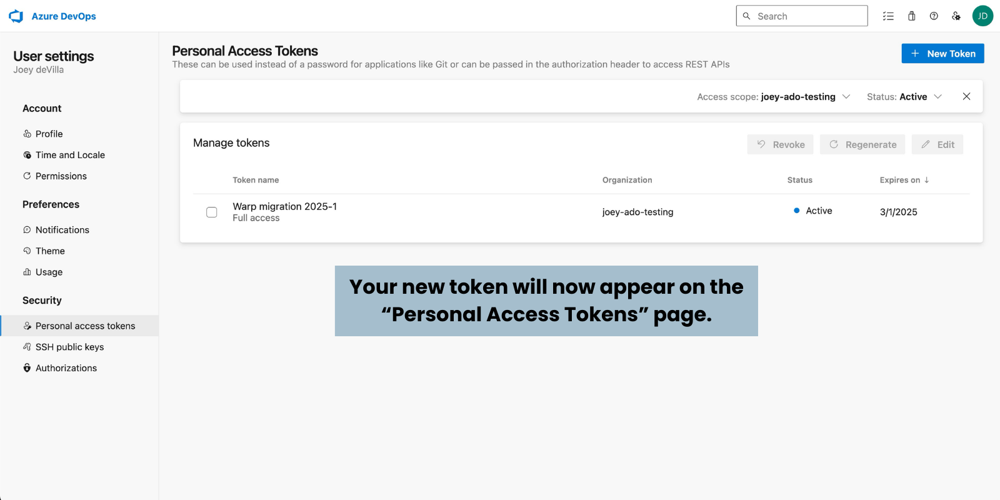<figcaption><p>The updated <em>Personal Access Tokens</em> page, featuring your newly-created token.</p></figcaption></figure>

You now have a personal access token that Warp will use to connect to the Azure DevOps organization whose repositories will be migrated.

#### 3b. Generate a PAT for Your GitHub Account

Let’s now generate a PAT for your GitHub account.

<figure>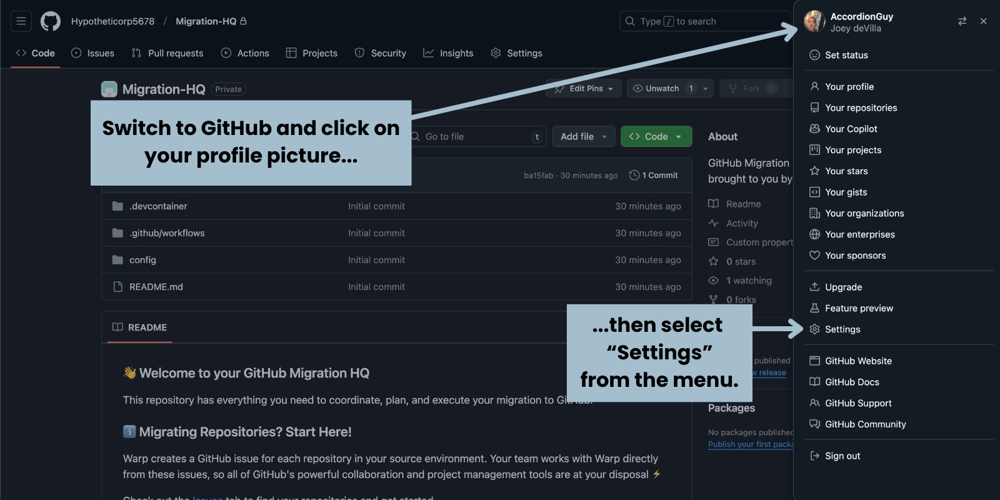<figcaption><p>How to get to the GitHub <em>Settings</em> page.</p></figcaption></figure>

🛠️ Switch to GitHub, then click on your profile picture. Select **Settings** from the menu that appears.

You will be taken to the _Settings_ page for your GitHub account:

<figure>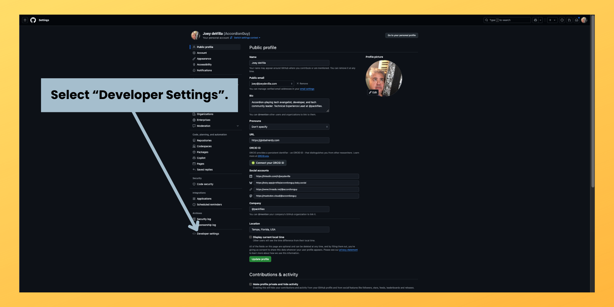<figcaption><p>How to get to the <em>Developer Settings</em> page.</p></figcaption></figure>

🛠️ In the menu on the left side of the page, click on **Developer settings** (you may need to scroll down a bit).

This will take you to the _Developer settings_ page:

<figure>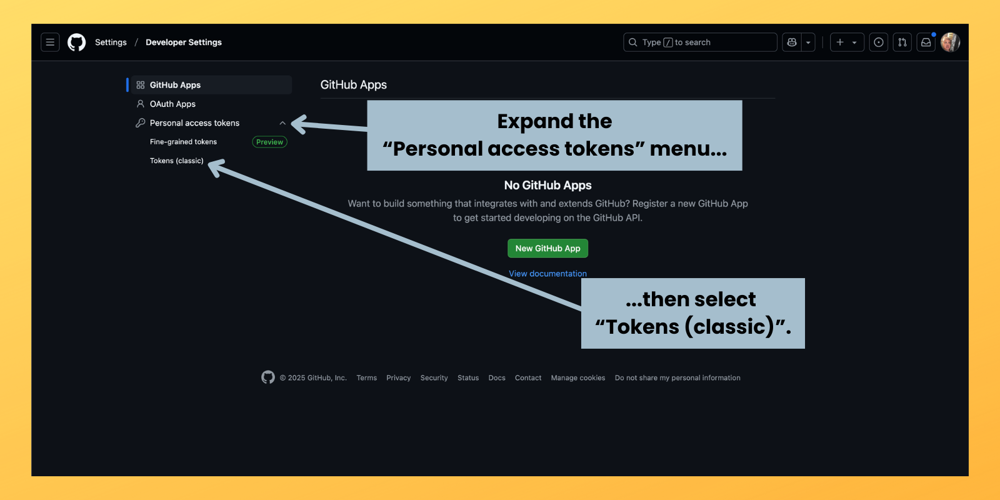<figcaption><p>Creating a personal access token in GitHub, part one.</p></figcaption></figure>

🛠️ In the menu on the left side of the page, expand the **Personal access tokens** item, then select **Tokens (classic)**.

You will end up at the _Personal access tokens (classic)_ page:

<figure>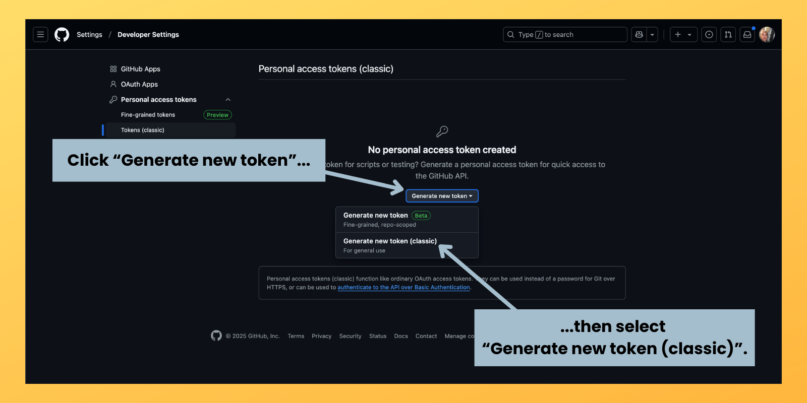<figcaption><p>Creating a personal access token in GitHub, part two.</p></figcaption></figure>

🛠️ Click the **Generate new token** button, then select **Generate new token (classic)** from the menu that appears.

You will arrive at the _New personal access token (classic)_ page, where you’ll need to provide enough information to create a new personal access token:

<figure><figcaption><p>The top of the <em>New personal access token (classic)</em> page. Make sure you check the indicated boxes!</p></figcaption></figure>

🛠️ Enter a name or some other text to help you identify the token in the **Note** field. To make it easier to identify, we suggest you include “Warp” in the name.

ℹ️ For the purposes of this Quickstart, we’ll leave the **Expiration** field at the default value of 30 days.

🛠️ Under **Select scopes**, check the following boxes, which will appear in this order:

* **repo**
* **workflow**
* **write:packages**
* **delete:packages**

🛠️ There are a few more items to check. Scroll down a little further...

<figure>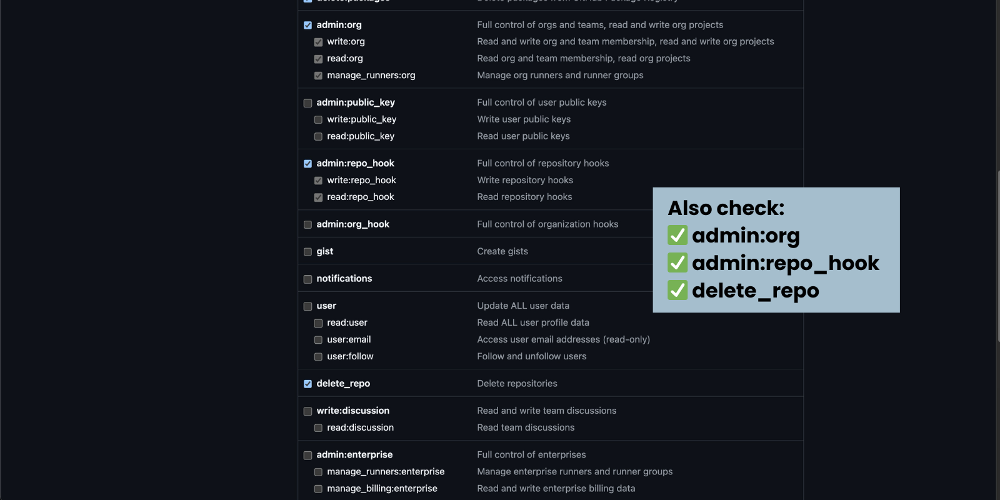<figcaption><p>Farther down the <em>New personal access token (classic)</em> page. Make sure you check the indicated boxes!</p></figcaption></figure>

🛠️ ...then check the following:

* **admin:org**
* **admin:repo\_hook**
* **delete\_repo**

🛠️ Scroll to the bottom of the page. You’ll see this:

<figure>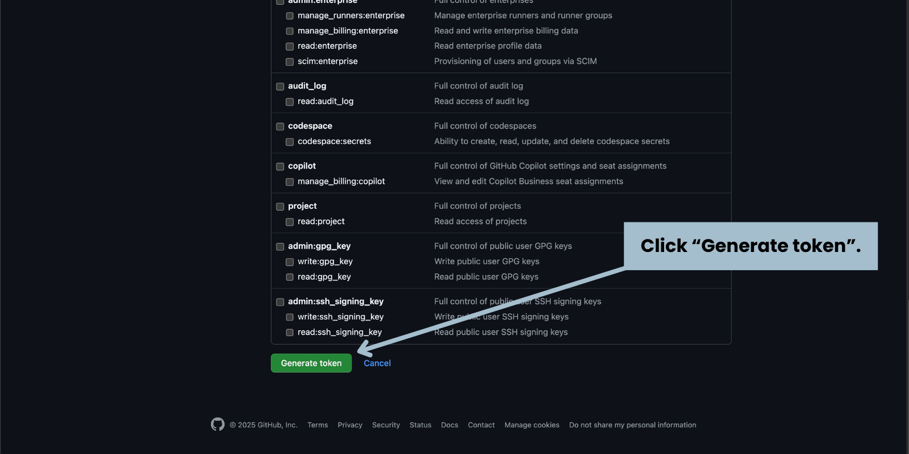<figcaption></figcaption></figure>

🛠️ Click the **Generate token** button.

You should now see this page, which will display the personal access token you just created:

<figure>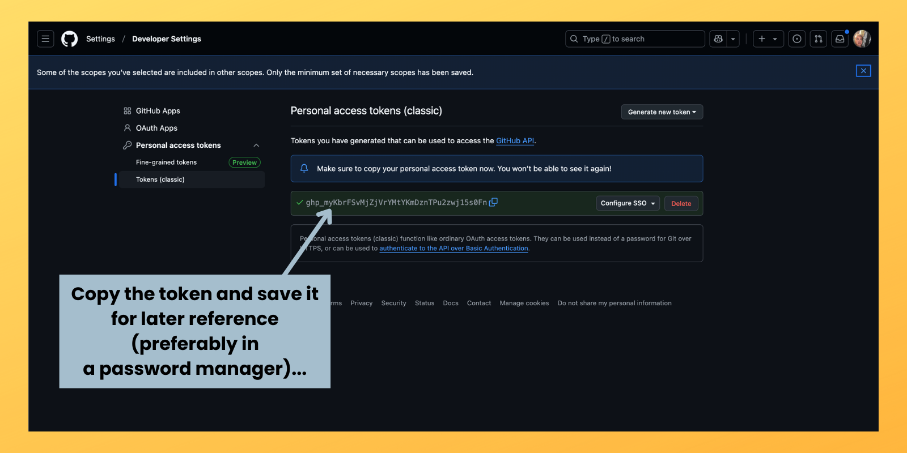<figcaption><p>The bottom of the <em>New personal access token (classic)</em> page.</p></figcaption></figure>

🛠️ Just as you did with the personal access token in Azure DevOps, copy this new personal access token and save it in a safe place — preferably a password manager. Warp needs this token to migrate the repositories to GitHub.

Once again, this will be your only time that this personal access token will be presented to you. Make sure you’ve copied it someplace safe before closing this web page!

### 4. Set Up the Vault

Now that you’ve generated personal access tokens for both your Azure DevOps organization and GitHub account, you need to make them available to Warp so that it can perform migrations, while securing them so that they are only available to Warp. You’ll do this by setting up a _vault_ — an encrypted file that stores the personal access tokens, which Warp will decrypt with a _vault key_.

🛠️ Open a command-line terminal on your computer, using the _Terminal_ application on macOS or Linux, or _Command Prompt_ or _PowerShell_ on Windows and change to the directory containing the cloned _Migration HQ_ repository.

🛠️ Run the following command, which starts the Warp command-line application that sets up the vault:

```bash
gh warp vault setup
```

You will see the “Welcome” text pictured below:

<figure>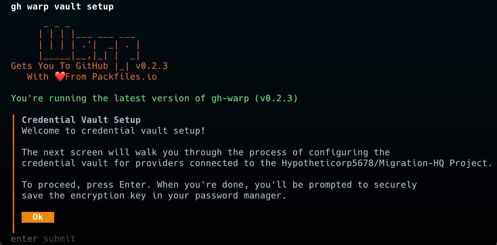<figcaption><p>The “Welcome” page of the <em>Vault Setup</em> application.</p></figcaption></figure>

🛠️ Press the **Enter** or **Return** key to continue.

You will see the _Configure Providers_ menu, which lets you add, update, and delete tokens for various source control providers:

<figure>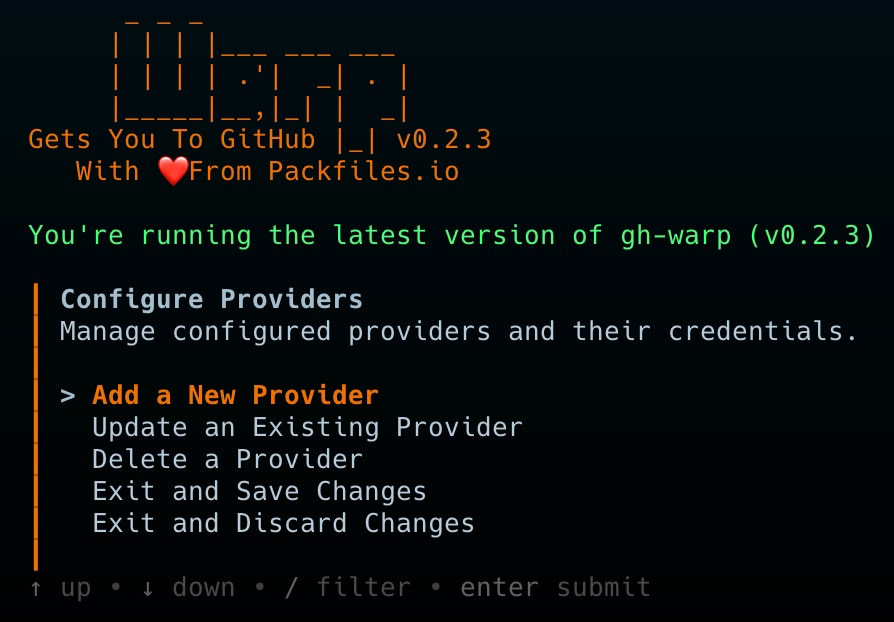<figcaption><p>The main menu of the <em>Vault Setup</em> application.</p></figcaption></figure>

🛠️ The default option, **Add a New Provider**, is the one you want. Press the **Enter** or **Return** key to select this option.

<figure>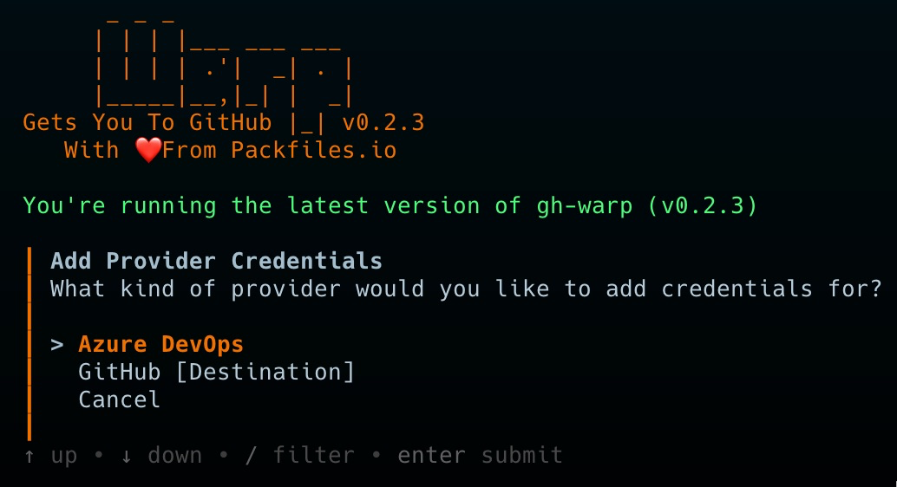<figcaption><p>The <em>Add Provider Credentials</em> menu of the <em>Vault Setup</em> application, with <em>Azure DevOps</em> selected.</p></figcaption></figure>

🛠️ Let’s add the personal access token for Azure DevOps first. Since **Azure DevOps** is the default option, simply press the **Enter** or **Return** key to select it.

You’ll see this text, which explains that you’re about to configure an Azure DevOps provider:

<figure><figcaption><p>The <em>Configure an Azure DevOps Provider</em> screen of the <em>Vault Setup</em> application.</p></figcaption></figure>

🛠️ Press the **Enter** or **Return** key to continue.

You will now be prompted to enter the personal access token you created in Azure DevOps:

<figure>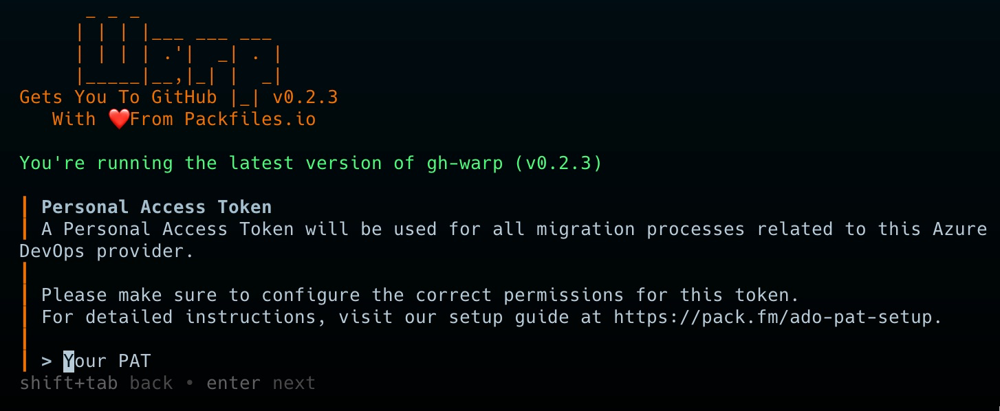<figcaption><p>The <em>Personal Access Token</em> screen for Azure DevOps in the <em>Vault Setup</em> application.</p></figcaption></figure>

🛠️ Paste your Azure DevOps personal access token into the text area marked **Your PAT**...


🛠️ ...then press the **Enter** or **Return** key to continue.

The next step is to specify the access scope for the Azure DevOps personal access token:

<figure>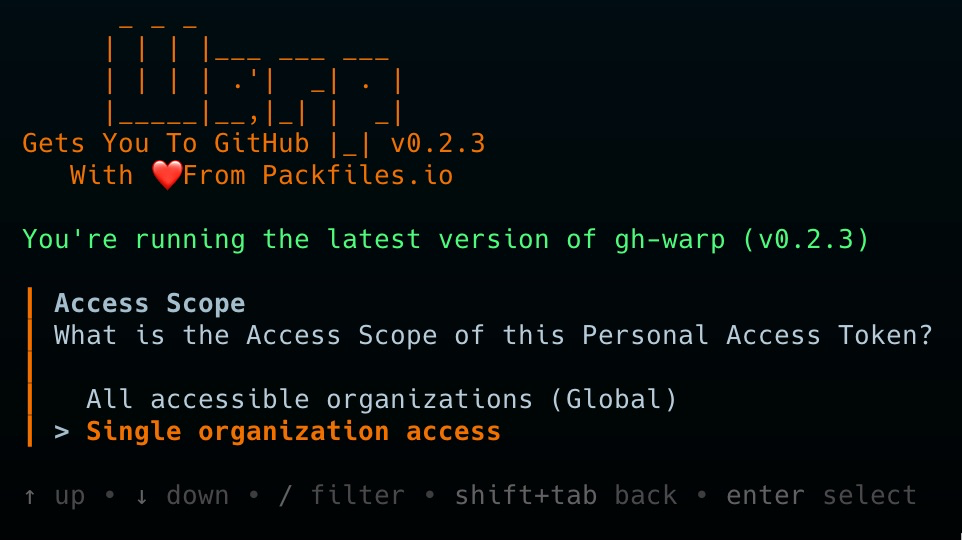<figcaption><p>The <em>Access Scope</em> menu of the <em>Vault Setup</em> application.</p></figcaption></figure>

🛠️ Select **Single organization access** using the ⬆️ and ⬇️ keys, then press the **Enter** or **Return** key.

You’ll be asked to enter the Azure Devops organization slug, which you copied when you were creating the personal access token for your Azure DevOps organization. In this example, the slug is `joey-ado-testing`:

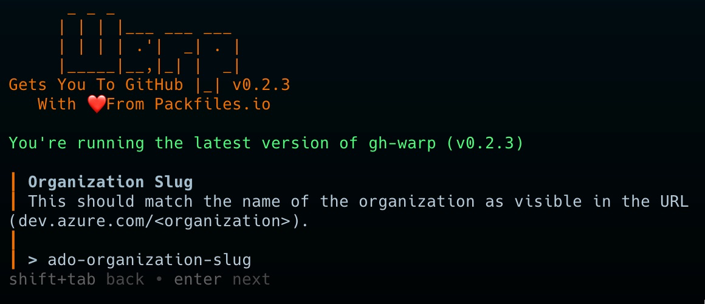

🛠️ Paste or enter the organization slug into the text area marked **ado-organization-slug**...

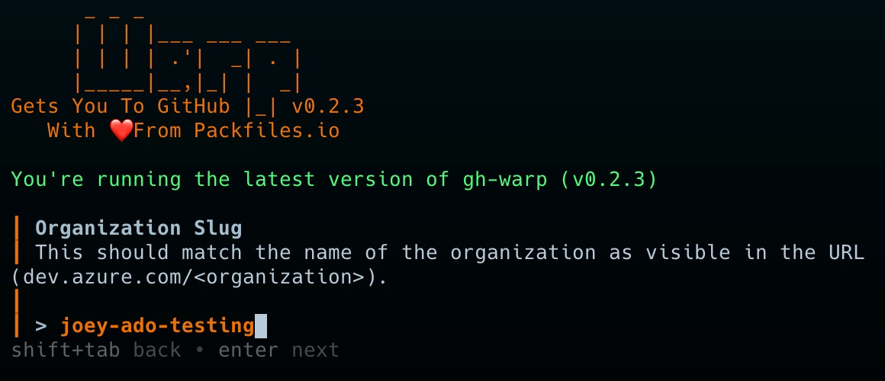

🛠️ ...then press the **Enter** or **Return** key to continue.

You’ll then be asked to specify the number of days until the token expires:

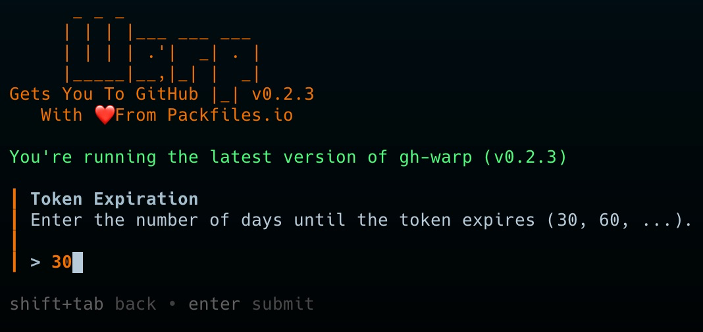

🛠️ Enter **30**, then press the **Enter** or **Return** key.

Finally, you’ll be asked to confirm the information you’ve entered:

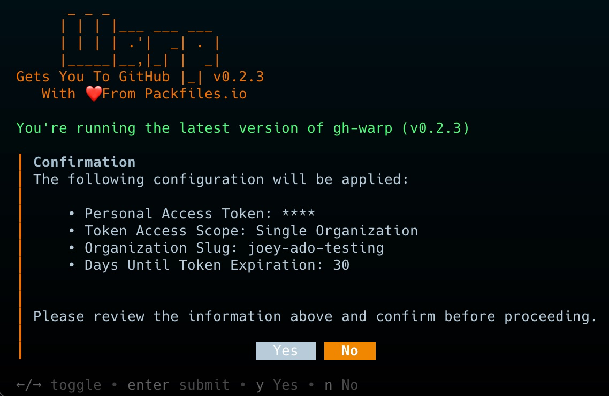

🛠️ Press **y** to confirm that the information is correct.

It’s time to add the personal access token for GitHub. You’ll see the _Configure Providers_ menu again:

<figure><figcaption><p>The main menu of the <em>Vault Setup</em> application.</p></figcaption></figure>

🛠️ Once again, the default option, **Add a New Provider**, is the one you want. Press the **Enter** or **Return** key to select this option.

![The Add Provider Credentials menu of the Vault Setup application, with GitHib \[Destination\] selected.](../../media/images/quickstart/vault_setup/vault_setup_select_add_github_credentials.png)

🛠️ Select **GitHub \[Destination]** using the ⬆️ and ⬇️ keys, then press the **Enter** or **Return** key.

You’ll see this text, which explains that you’re about to configure a GitHub destination:

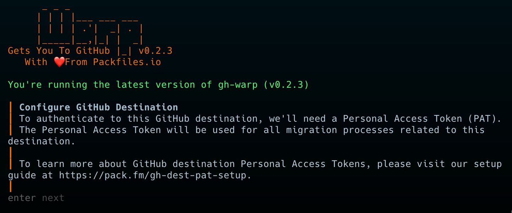

🛠️ Press the **Enter** or **Return** key to continue.

You will now be prompted to enter the personal access token you created in GitHub:

<figure><figcaption><p>The <em>Personal Access Token</em> screen for GitHub in the <em>Vault Setup</em> application.</p></figcaption></figure>

🛠️ Paste your GitHub personal access token into the text area marked **Your PAT**...

<figure>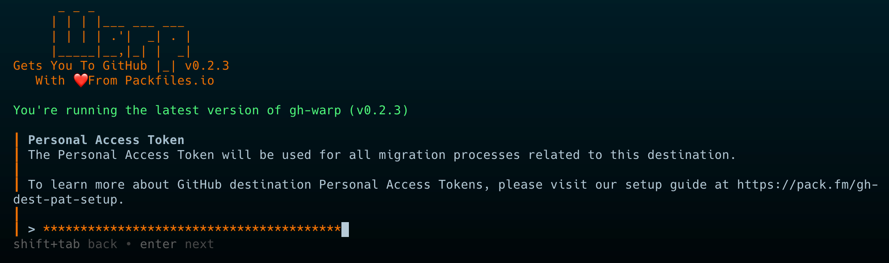<figcaption><p>The <em>Personal Access Token</em> screen for GitHub in the <em>Vault Setup</em> application, with the token pasted in.</p></figcaption></figure>

🛠️ ...then press the **Enter** or **Return** key to continue.

You’ll be asked to enter the GitHub organization slug, which you copied when you were creating the personal access token for your GitHub organization.

<figure>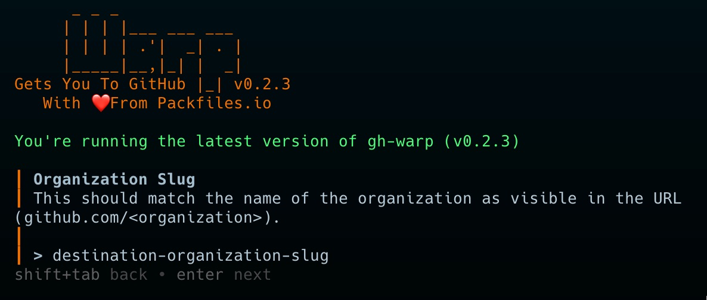<figcaption><p>The GitHub <em>Organization Slug</em> screen of the <em>Vault Setup</em> application.</p></figcaption></figure>

In this example, the slug is `Hypotheticorp5678`:

<figure><figcaption><p>The GitHub <em>Organization Slug</em> screen of the <em>Vault Setup</em> application, with the organization slug pasted in.</p></figcaption></figure>

🛠️ Paste or enter the organization slug into the text area marked **destination-organization-slug**, then press the **Enter** or **Return** key to continue.

You’ll then be asked to specify the number of days until the token expires:

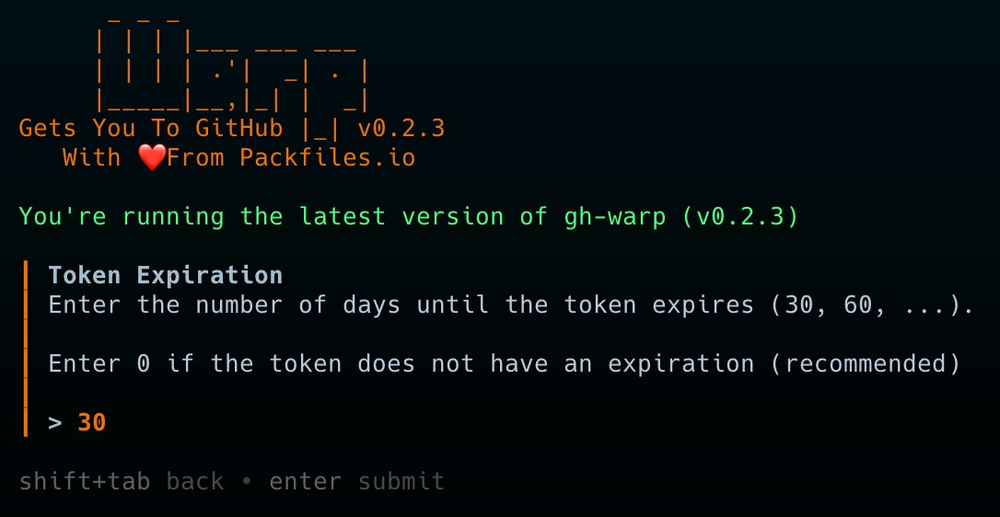

🛠️ Enter **30**, then press the **Enter** or **Return** key.

Finally, you’ll be asked to confirm the information you’ve entered:

<figure><figcaption><p>The <em>Confirmation</em> screen for the GitHub token in the <em>Vault Setup</em> application.</p></figcaption></figure>

🛠️ Press **y** to confirm that the information is correct.

You will return to the _Configure Providers_ menu.

<figure><figcaption><p>The main menu of the <em>Vault Setup</em> application, with Exit and Save Changes selected.</p></figcaption></figure>

🛠️ Select **Exit and Save Changes** using the ⬆️ and ⬇️ keys, then press the **Enter** or **Return** key.

This will create the vault file, which needs to be committed and pushed to the _Migration HQ_ repository. You will see this prompt:

<figure><figcaption><p>The <em>Commit and Push Changes</em> screen of the <em>Vault Setup</em> application.</p></figcaption></figure>

🛠️ Use the default option, **Yes**, then press the **Enter** or **Return** key.

You will see the _Save Your Vault Key_ prompt:


🛠️ Just as you did with the personal access token in Azure DevOps and GitHub, copy the vault key and save it in a safe place — preferably a password manager. You will need it to unlock the personal access tokens that were encrypted into the vault.

🛠️ After you have copied and saved the vault key, press the **Enter** or **Return** key to continue.

You’ll see the final message:

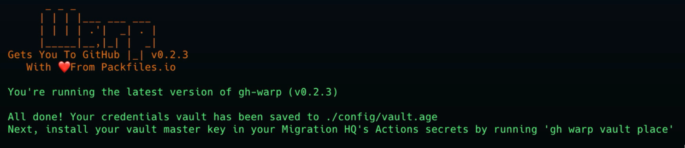

At this point:

* The Azure DevOps and GitHub personal access tokens have been encrypted into the vault file (`config/vault.age` on macOS and Linux, `config\vault.age` on Windows)
* The vault file has been committed and pushed to the _Migration HQ_ repository.

#### Store the Vault key in _Migration HQ_

The next step is to store the key for the vault file in the _Migration HQ_ repository. This will allow the Warp GitHub Actions to access the personal access tokens you encrypted into the vault, which in turn will allow them to migrate your repositories from Azure DevOps to GitHub.

You _could_ do this manually by copying the vault key and pasting it into the _Migration HQ_ repository’s _Secrets_ section. However, Warp provides a command-line application that will do this for you. Let’s use it.

🛠️ Run the following command, which starts the Warp command-line application that stores the vault key in the _Migration HQ_ repository:

```bash
gh warp vault place
```

You’ll be greeted with the following text:


🛠️ Press the **Enter** or **Return** key to continue.

You’ll be prompted to enter your vault key:


🛠️ Paste the vault key into the text area...

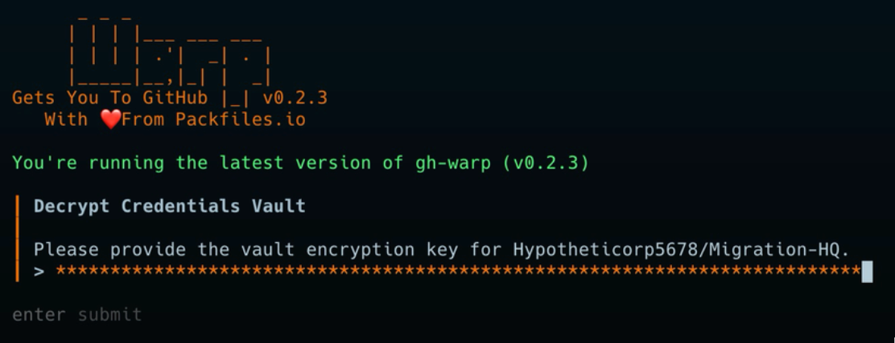

🛠️ ...then press the **Enter** or **Return** key to continue.

The app will store your vault key into the _Migration HQ_ repository’s secrets and display this message:

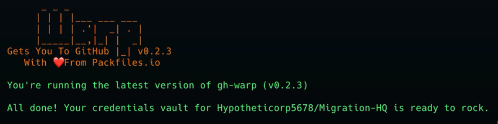

You should confirm that your vault key was successfully stored in _Migration HQ_ by checking the repository’s _Secrets_ section in GitHub:

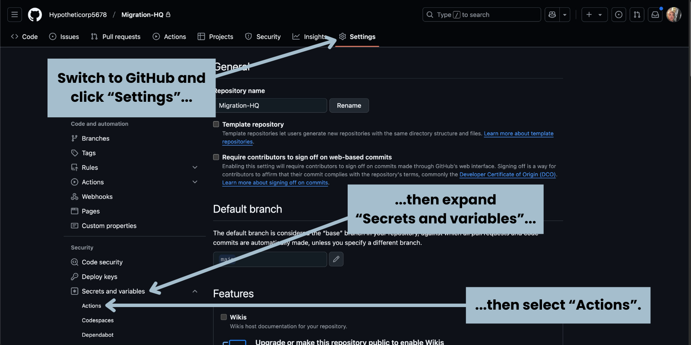

🛠️ Open a browser tab or window to the _Migration HQ_ repository in GitHub and click the **Settings** tab.

🛠️ In the menu on the left side of the page, select **Secrets and variables** to expand it, then select **Actions**.

You should see the _Actions secrets and variables_ page for _Migration HQ_ :


🛠️ Check the _Repository secrets_ section and confirm that it contains a secret named `PKFS_MASTER_KEY`.

If you see the `PKFS_MASTER_KEY` secret, you have successfully stored the vault key in _Migration HQ_. If not, you should run the `gh warp vault place` command again.

### 5. Connect Azure DevOps

The next step is to connect your Azure DevOps account to Warp. This will allow Warp to access the repositories you want to migrate from Azure DevOps to GitHub.

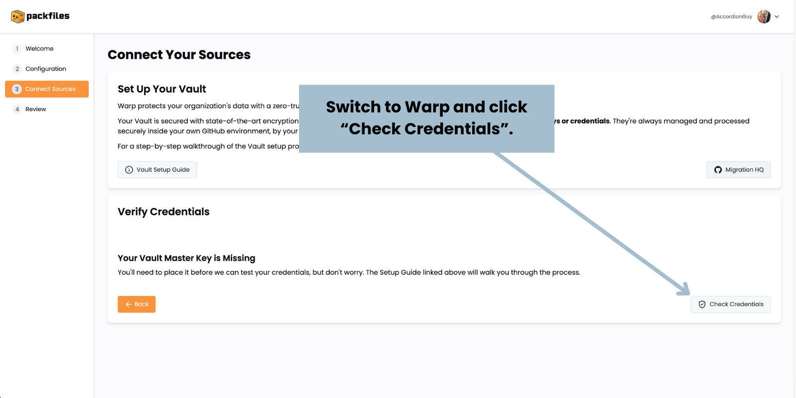

🛠️ Go back to the Warp browser tab or window. Make sure that you’re on the _Connect Your Sources_ page shown above, then click the **Check Credentials** button near the lower right corner of the page.

The text in the _Verify Credentials_ section will change to “We’re checking your Vault’s credentials. This will take a moment...”:

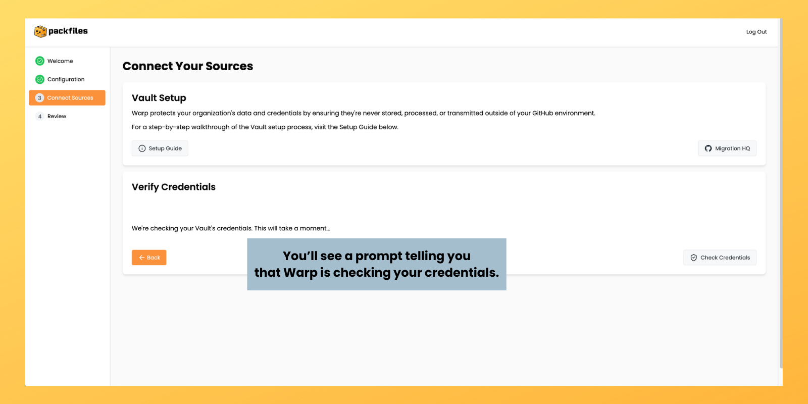

🛠️ While Warp is examining your vault, switch to the browser tab or window that you were using for the _Migration HQ_ repository in GitHub:

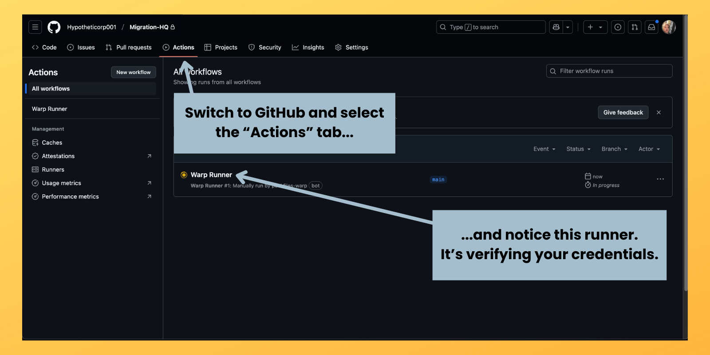

🛠️ Select the **Actions** tab. This will display the list of _Migration HQ_’s workflows.

If you switched to the GitHub browser tab or window and clicked the **Actions** tab quickly enough, you should see a workflow with a spinning yellow icon named **Warp Runner Agent**. The yellow icon denotes that it is currently running. This workflow is using the vault key you stored in _Migration HQ_’s secrets to unlock the personal access tokens for Azure DevOps and GitHub.

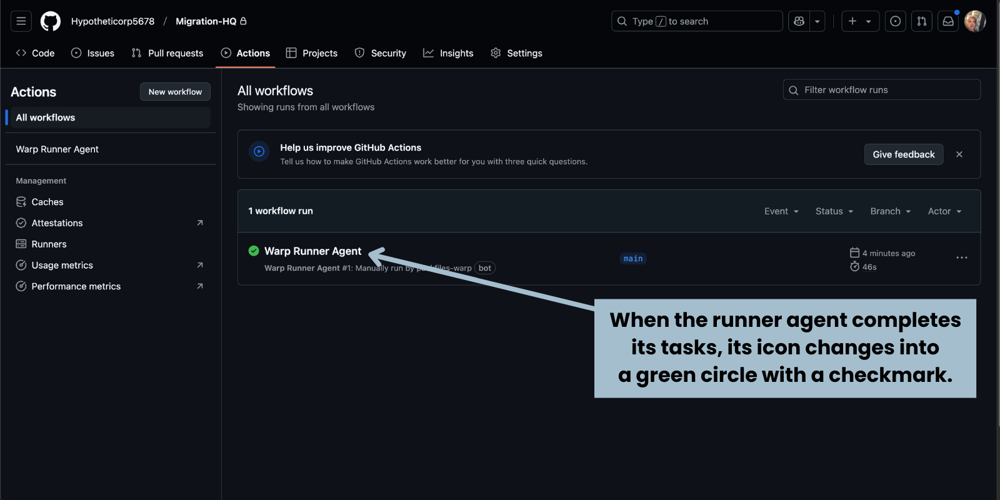

🛠️ Wait until the spinning yellow icon is be replaced by a green checkmark. This means that the vault key was successfully used to unlock the personal access tokens for Azure DevOps and GitHub.

🛠️ Switch back to the browser tab or window for Warp:

<figure>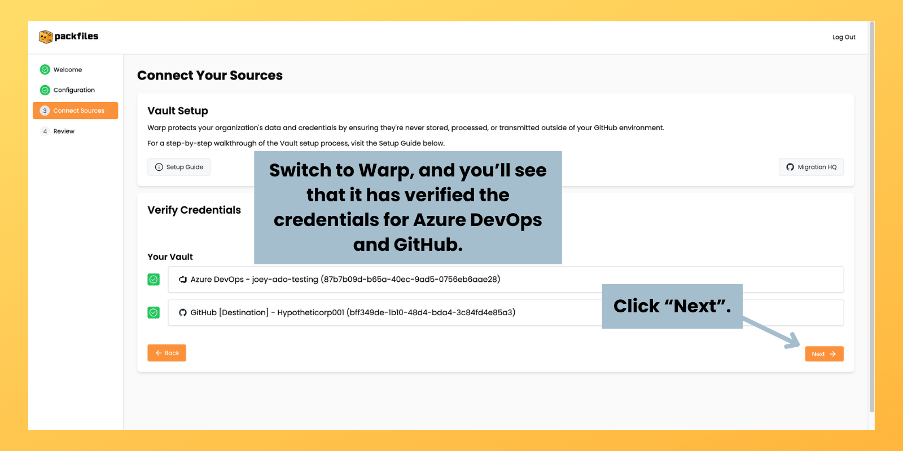<figcaption><p>Warp’s <em>Connect Your Sources</em> page, after the vault credentials have been verified.</p></figcaption></figure>

You should see a section below _Verify Credentials_ titled _Your Vault_. It should contain two items:

* An item representing the Azure DevOps Organization containing the repositories you want to migrate, and
* An item representing the GitHub organization where you want to migrate the repositories.

If you don’t see these items, click your browser’s **Refresh** button.

🛠️ Click the **Next** button.

You’ll arrive at the _All Done!_ page, which marks the end of the process of configuring the project:

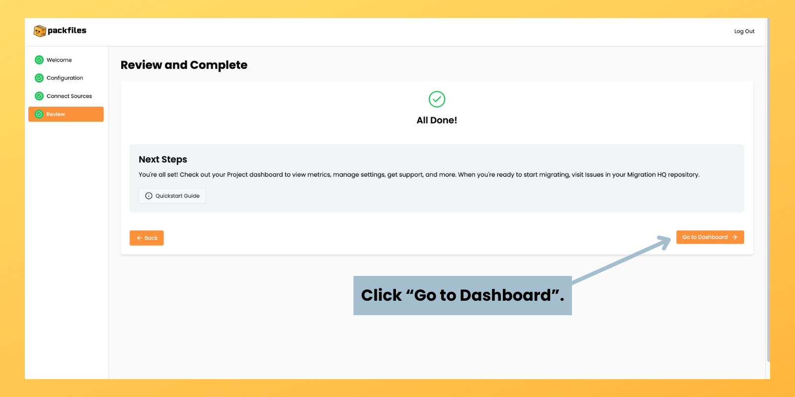

🛠️ Let’s check the project’s status. Click the **Go to Dashboard** button.

#### Check the Project’s Status

The _Dashboard_ page shows the status of the project you just configured:

<figure>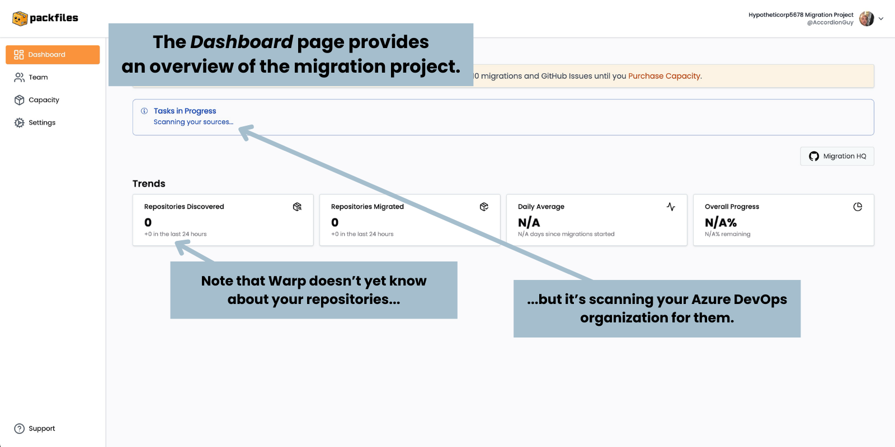<figcaption><p>Warp’s <em>Dashboard</em> page.</p></figcaption></figure>

The **Trends** section displays the following statistics:

* The number of repositories that Warp found in the Azure DevOps Organization,
* the number of repositories that have been migrated to GitHub,
* the average number of repositories that have been migrated per day, and
* the overall progress of the migration, expressed as a percentage.

The text above the **Trends** section says “Tasks in Progress” and “Scanning your sources...” Warp is scanning your Azure DevOps organization for repositories. Let’s see this process in action.

🛠️ Switch to the browser tab or window for the _Migrations HQ_ repository and select the **Actions** tab:

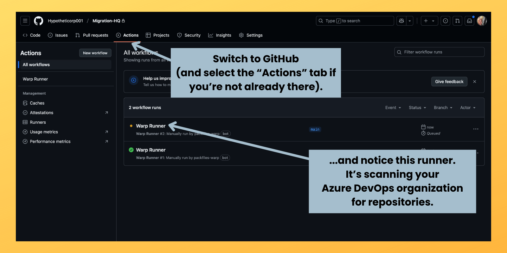

You should see a new workflow with a spinning yellow icon named **Warp Runner Agent**. The yellow icon denotes that it is currently running. This workflow is scanning the Azure DevOps organization for repositories.

🛠️ Wait for the Warp Runner Agent workflow to start and finish. You’ll know it’s finished when the spinning yellow icon is replaced by a green checkmark. The process may take a few minutes, depending on how many repositories are in your Azure DevOps organization.

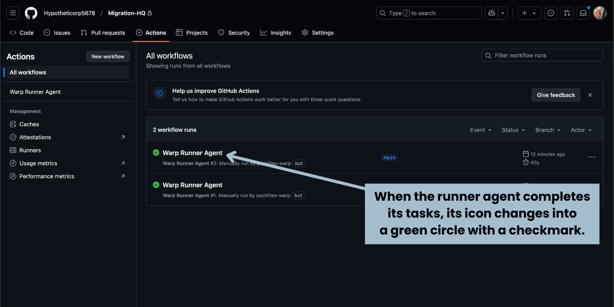

🛠️ When the Warp Runner Agent has finished its tasks, switch back to the browser tab or window with the Warp Dashboard:

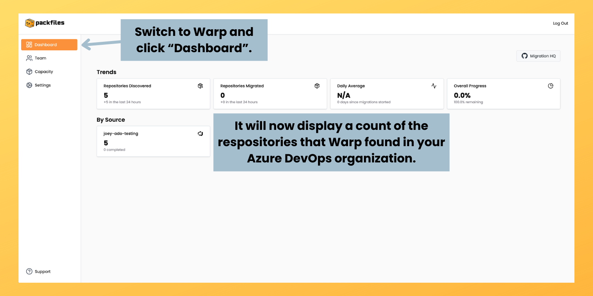

You should see the updated statistics on the _Dashboard_ page. The number of repositories found in the Azure DevOps Organization should now be displayed.

If you don’t see a count of discovered Azure DevOps repositories, click your browser’s **Refresh** button.

### 6. Migrate a Repository

So far, here’s what you’ve done:

* Created a new projectGenerated personal access tokens for Azure DevOps and GitHub
* Set up the vault
* Stored the vault key in _Migration HQ_
* Connected your Azure DevOps account to Warp
* Scanned the Azure DevOps Organization for repositories.

It’s finally time to migrate a repository from Azure DevOps to GitHub!

🛠️ Switch to the browser tab or window with _Migration HQ_ and select the **Issues** tab:

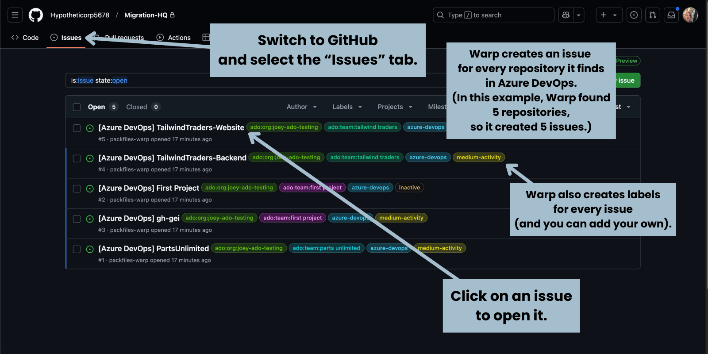

Warp creates an issue in the _Migration HQ_ repository for every repository it finds in your Azure DevOps organization. These issues are used to manage the migration of repositories from Azure DevOps to GitHub.

🛠️ Click on the issue for the repository you want to migrate. In this example, we’re clicking on the issue named **TailwindTraders-Website**.

The page for the issue will appear:

<figure>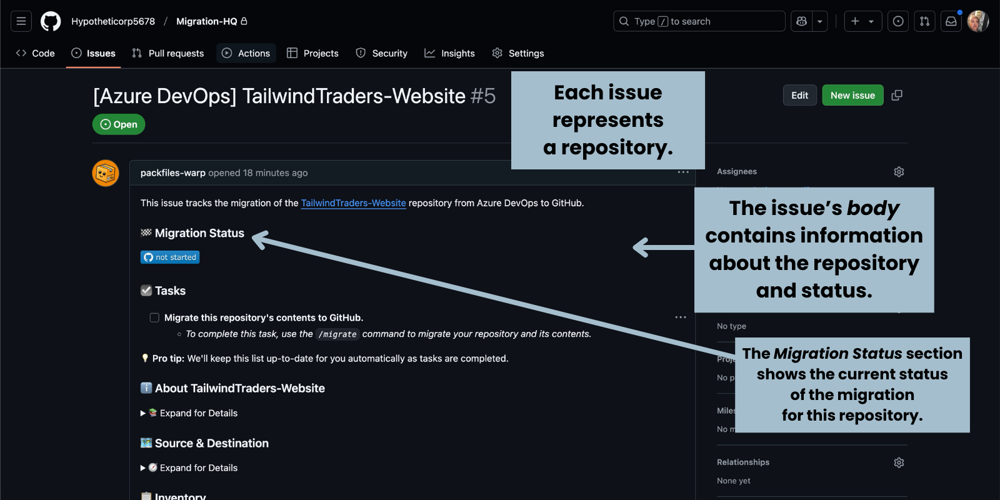<figcaption><p>The issue page for one of the repositories to be migrated.</p></figcaption></figure>

The body of the issue — the part that contains a description and other notes about the issue — contains information assembled by Warp about the corresponding repository.

If you take a closer look at the body, you’ll see that it’s divided into the following subsections:

* **Migration Status:** This section shows the current status of the migration. Since the migration hasn’t started yet, its status is **not started**.

<figure>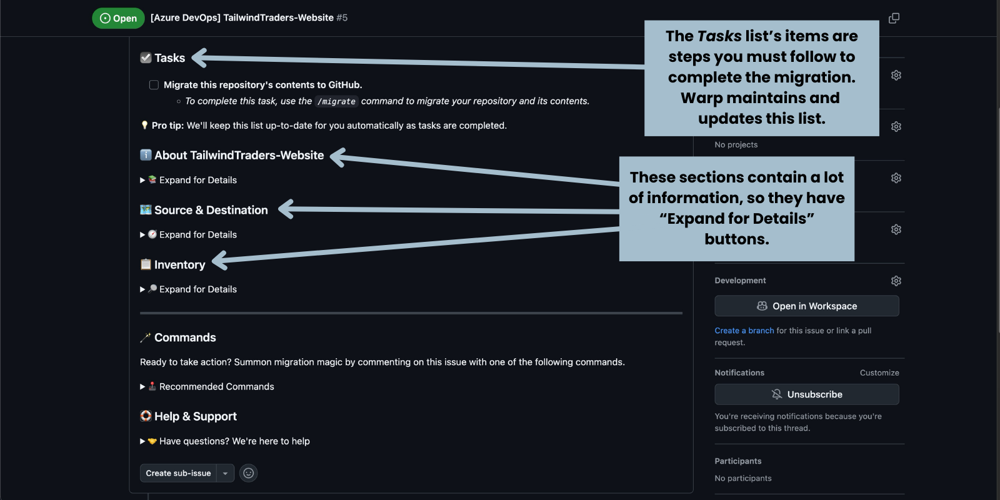<figcaption><p>The top part of the issue’s body.</p></figcaption></figure>

* **Tasks:** This section has a checklist of the tasks that need to be performed to migrate the repository. Warp will automatically check off the tasks as they are completed.

<figure><figcaption><p>The bottom part of the issue’s body.</p></figcaption></figure>

* **About:** This lists basic information about the source repository, such as when its last commit was, how many commits it’s had in the past year, who its most active contributor was, and its size.
* **Source & Destination:** This provides links to the source and the destination repositories.
* **Inventory:** This shows information about the destination repository. Since the migration hasn’t started yet, this section simply says that the repository hasn”t been migrated yet.

<figure>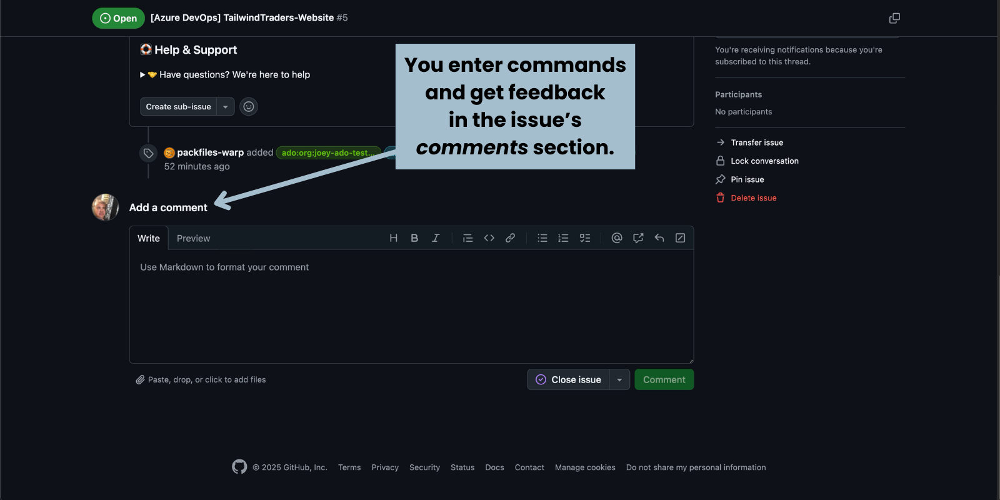<figcaption><p>The comments section of the issue.</p></figcaption></figure>

It’s time to migrate!

🛠️ Scroll down the page to the comments section...

<figure>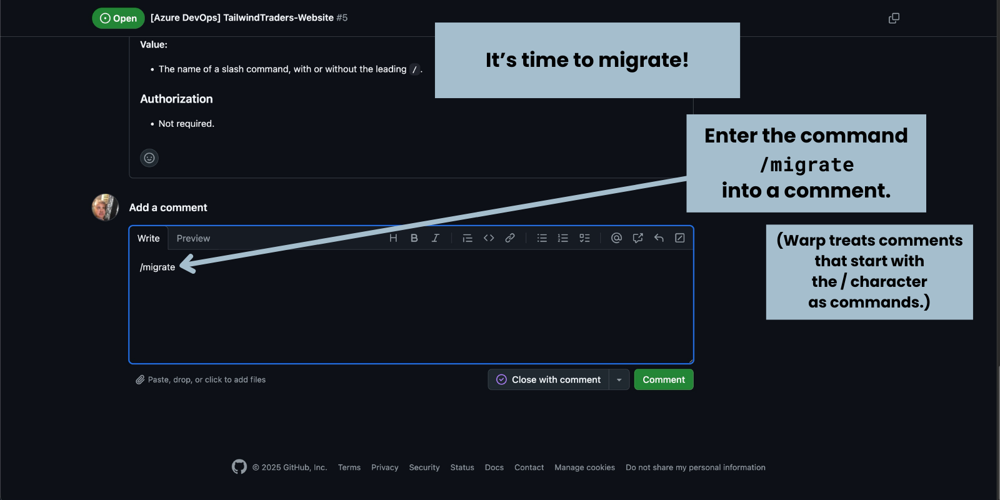<figcaption><p>Issuing the <code>/migrate</code> command.</p></figcaption></figure>

🛠️ ...and in the first comment, enter the following command:

```bash
/migrate
```

In moments, Warp will reply with a follow-up comment announcing that the migration has started:

<figure>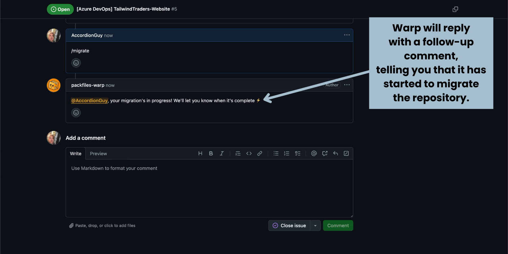<figcaption><p>Warp’s response comment to the <code>/migrate</code> command.</p></figcaption></figure>

Depending on a number of factors, including the size of the repository and how many migrations Warp is performing at the same time, the migration may take a few to several minutes to complete.

🛠️ In the meantime, switch to the browser tab or windows for _Migration HQ_ and click the **Actions** tab:

<figure>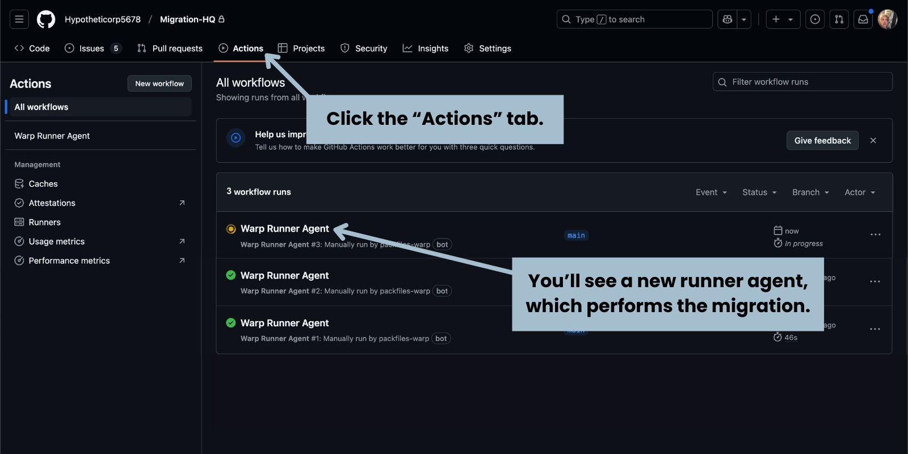<figcaption><p>The <em>Actions</em> page of <em>Migration HQ</em>, showing the runner agent performing the migration. </p></figcaption></figure>

You should see a new workflow with a spinning yellow icon named **Warp Runner Agent**. The yellow icon denotes that it is currently running. This workflow is performing the task of migrating the repository from Azure DevOps to GitHub.

<figure>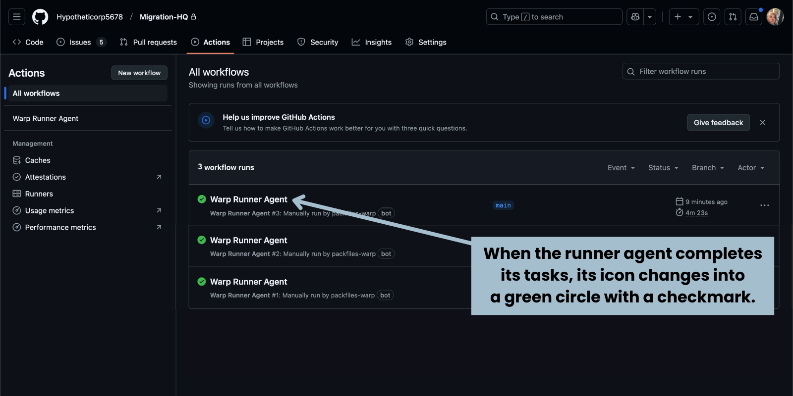<figcaption><p>The <em>Actions</em> page of <em>Migration HQ</em>, after the runner agent has completed its tasks.</p></figcaption></figure>

Eventually, the runner agent will complete its tasks, and its icon will change from spinning yellow to a green circle with a checkmark. This means that Warp has finished migrating the repository.

🛠️ Confirm that the repository has been migrated by clicking the **Issues** tab:

<figure>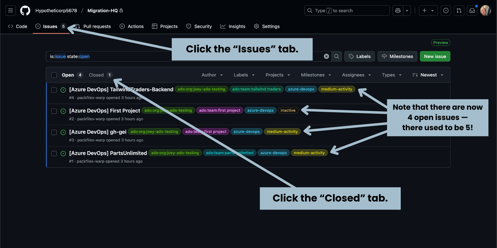<figcaption><p>The open issues tab of the <em>Issues</em> page in <em>Migration HQ</em>. Note that there is one less open issue.</p></figcaption></figure>

You’ll see the list of open issues. In our example, there are now only _four_ open issues, where there were _five_ originally. Migrating the repository closed its issue.

🛠️ Let’s look at the closed issues. Click on the **Closed** tab.

You’ll see the list of closed issues. It should contain the issue for the repository you just migrated:

<figure>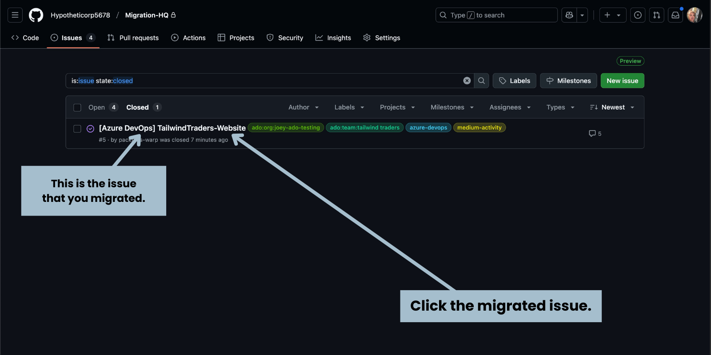<figcaption><p>The closed issues tab of the <em>Issues</em> page in <em>Migration HQ</em>. Note that there is one new closed issue.</p></figcaption></figure>

🛠️ Examine the issue by clicking it:

<figure>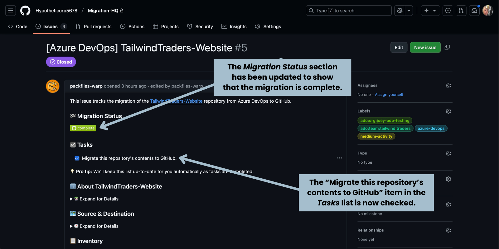<figcaption><p>The closed issue’s updated <em>Migration Status</em> section.</p></figcaption></figure>

When the issue page opens, you’ll see a number of changes:

* The **Migration Status** section now shows a graphic indicating that the migration is complete.
* The _Migrate this repository’s comments to GitHub_ checkbox in the **Tasks** list is now checked.

<figure>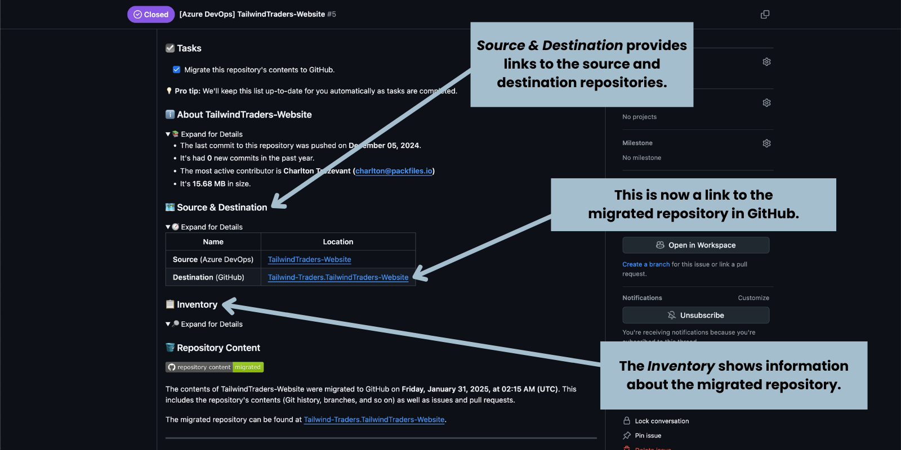<figcaption><p>The closed issue’s updated <em>Source &#x26; Destination</em> and <em>Inventory</em> sections.</p></figcaption></figure>

* The **Source and Destination** section now has links for both the source and destination repositories.
* The **Inventory** section now shows information about the migrated repository.

🛠️ Scroll to the comments section:

<figure>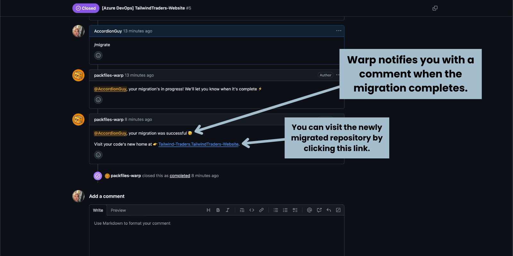<figcaption><p>The closed issue’s comments section, featuring Warp’s comment saying that the migration was successful.</p></figcaption></figure>

You’ll see a new comment from Warp, complete with a link to the destination repository.

🛠️ Click on the link to visit the newly-migrated repository.

You’ll see the repository’s page — _in GitHub!_ — with all of its files, branches, and commits:

<figure>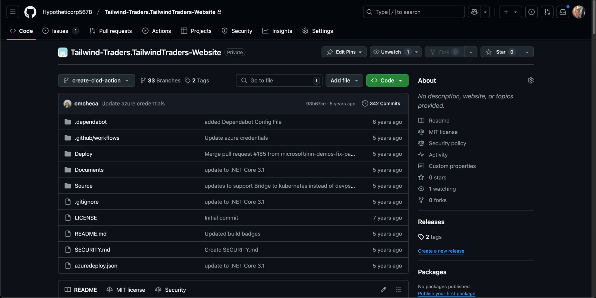<figcaption><p>The newly migrated repository in GitHub.</p></figcaption></figure>

When you started, the GitHub organization had a single repository: _Migration HQ_.

🛠️ Click on the organization’s name (near the top left corner of the page), followed by the **Repositories** tab.

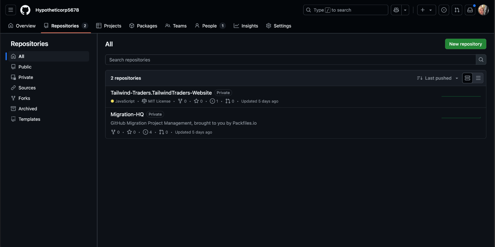

You’ll see that the organization now has _two_ repositories: _Migration HQ_ and the repository you just migrated from Azure DevOps.

🙌 Congratulations! You’ve successfully migrated a repository from Azure DevOps to GitHub using Warp.
