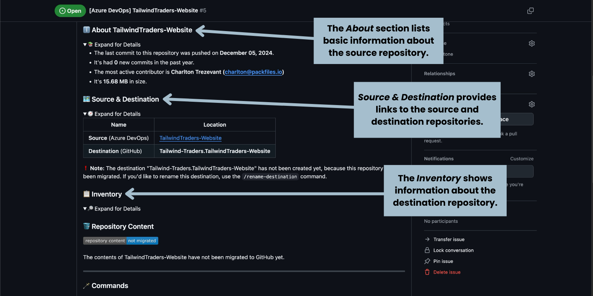
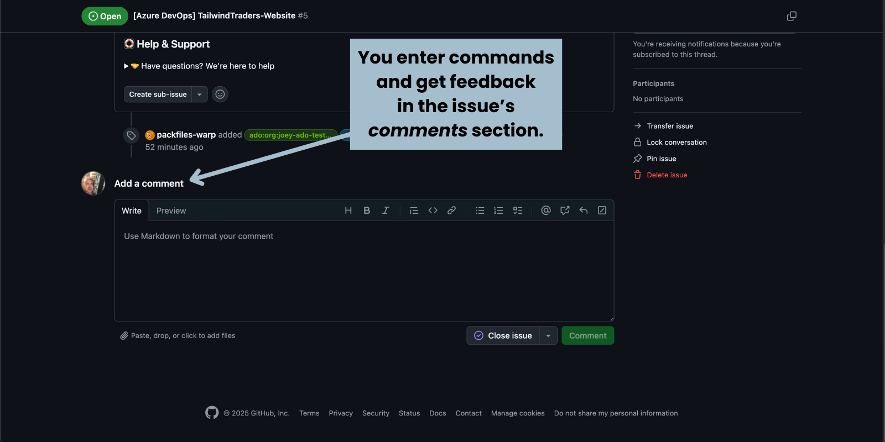
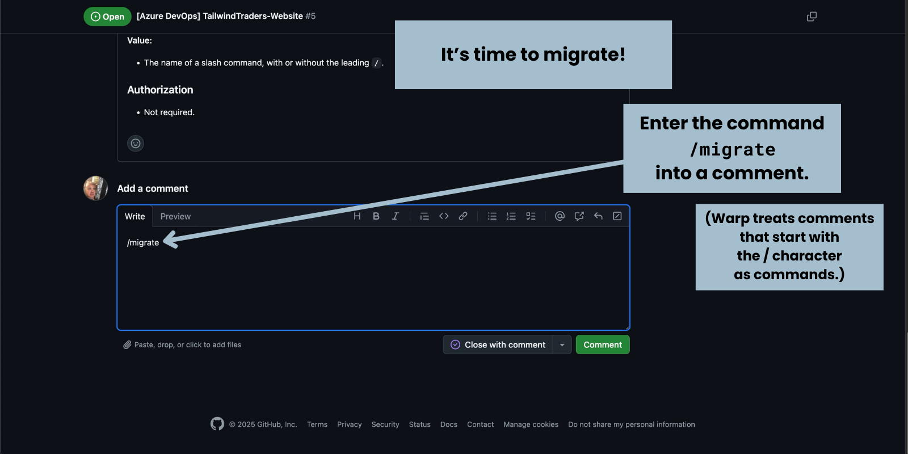
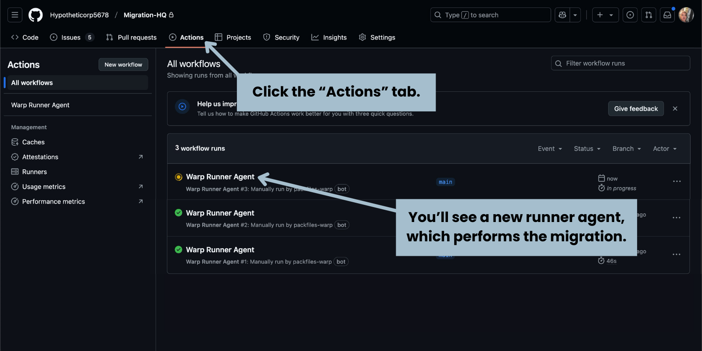
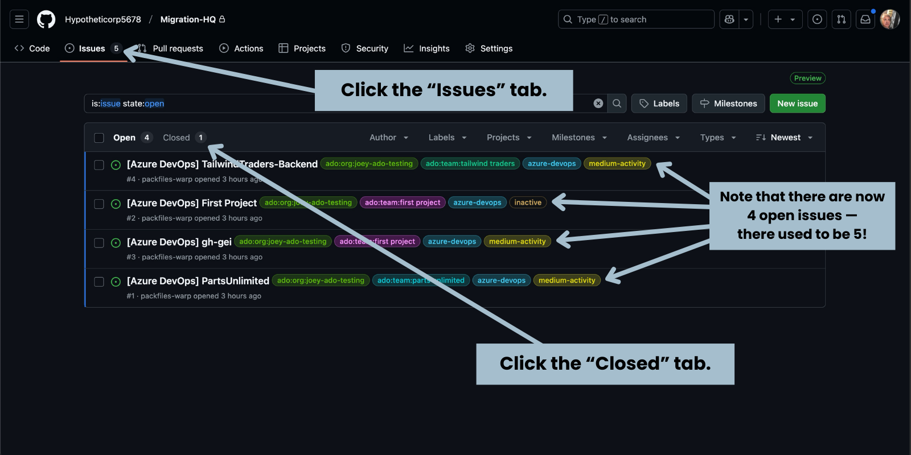
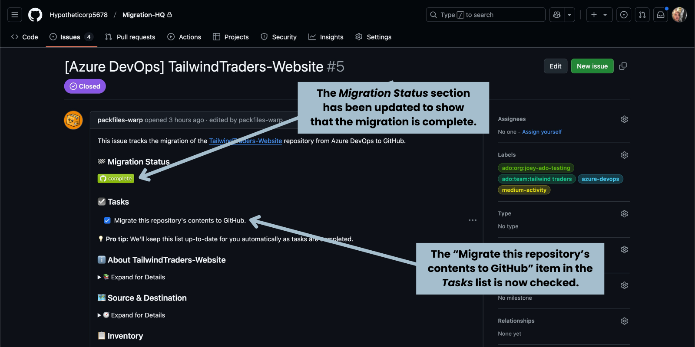
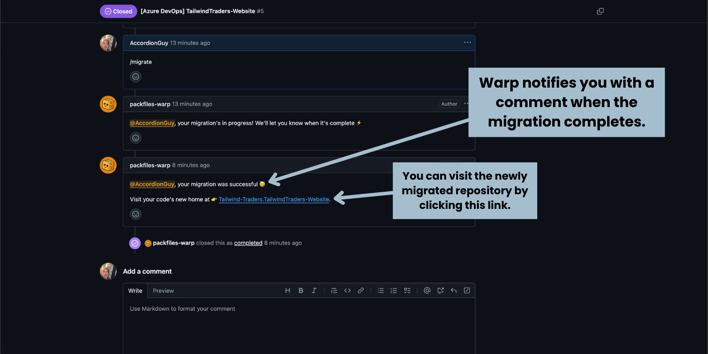

# Extra Credit

You can also manually change an issue’s status:

* **Manually closing an open issue** by marking it as **Completed** or **Not Planned**. This moves the issue to the closed issues list and Warp’s migration commands will be disabled for that issue’s repository.
* **Manually opening a closed issue** by marking it as **Open**. This moves the issue to the open issues list and Warp’s migration commands will be enabled for that issue’s repository.

Warp uses GitHub’s issues lists to categorize repositories this way:

* **Open issues:** Repositories to be migrated.
* **Closed issues:** Repositories that are either migrated or ignored.

### Examine the Repository

Before we migrate the repository, let’s examine its issue page.

#### Title

At the top, you’ll find its title and issue status:

<figure><figcaption></figcaption></figure>

In this example, the source is Azure DevOps, the repository’s name is _TailwindTraders-Website_, and its status is **Open**, meaning that this is a repository to be migrated.

#### Attribution

The body of the issue appears below the title, starting with the attribution:

<figure><figcaption></figcaption></figure>

Anything created by Warp, including this issue, will be attributed to the user **packfiles-warp**.

#### Description

The next item in the body is a quick description of the issue:

<figure><figcaption></figcaption></figure>

This description will include a link to the source repository. In this example, clicking the **TailwindTraders-Website** link will take you to the repository’s page in Azure DevOps.

#### Migration Status and Tasks Checklist

After the description will be the _Migration Status_ section:

<figure><figcaption></figcaption></figure>

Since the migration has not yet taken place, _Migration Status_ displays the  indicator. This will change after the repository has been migrated.

The _Tasks_ checklist appears after the indicator. Warp will automatically check items on this list so that you don’t have to.

#### About

The _About_ section contains information about the source repository:

<figure><figcaption></figcaption></figure>

To see this information, expand it:

<figure><figcaption></figcaption></figure>

#### Source & Destination


<figure><figcaption></figcaption></figure>

<figure><figcaption></figcaption></figure>

<figure><figcaption></figcaption></figure>

<figure><figcaption></figcaption></figure>

The body of the issue — the part that contains a description and other notes about the issue — contains information assembled by Warp about the corresponding repository.

If you take a closer look at the body, you’ll see that it’s divided into the following subsections:

* **Migration Status:** This section shows the current status of the migration. Since the migration hasn’t started yet, its status is **not started**.

<figure><figcaption><p>The top part of the issue’s body.</p></figcaption></figure>

* **Tasks:** This section has a checklist of the tasks that need to be performed to migrate the repository. Warp will automatically check off the tasks as they are completed.

<figure><figcaption><p>The bottom part of the issue’s body.</p></figcaption></figure>

* **About:** This lists basic information about the source repository, such as when its last commit was, how many commits it’s had in the past year, who its most active contributor was, and its size.
* **Source & Destination:** This provides links to the source and the destination repositories.
* **Inventory:** This shows information about the destination repository. Since the migration hasn’t started yet, this section simply says that the repository hasn”t been migrated yet.

<figure><figcaption><p>The comments section of the issue.</p></figcaption></figure>

It’s time to migrate!

🛠️ Scroll down the page to the comments section...

<figure><figcaption><p>Issuing the <code>/migrate</code> command.</p></figcaption></figure>

🛠️ ...and in the first comment, enter the following command:

```bash
/migrate
```

In moments, Warp will reply with a follow-up comment announcing that the migration has started:

<figure><figcaption><p>Warp’s response comment to the <code>/migrate</code> command.</p></figcaption></figure>

Depending on a number of factors, including the size of the repository and how many migrations Warp is performing at the same time, the migration may take a few to several minutes to complete.

🛠️ In the meantime, switch to the browser tab or windows for _Migration HQ_ and click the **Actions** tab:

<figure><figcaption><p>The <em>Actions</em> page of <em>Migration HQ</em>, showing the runner agent performing the migration. </p></figcaption></figure>

You should see a new workflow with a spinning yellow icon named **Warp Runner Agent**. The yellow icon denotes that it is currently running. This workflow is performing the task of migrating the repository from Azure DevOps to GitHub.

<figure><figcaption><p>The <em>Actions</em> page of <em>Migration HQ</em>, after the runner agent has completed its tasks.</p></figcaption></figure>

Eventually, the runner agent will complete its tasks, and its icon will change from spinning yellow to a green circle with a checkmark. This means that Warp has finished migrating the repository.

🛠️ Confirm that the repository has been migrated by clicking the **Issues** tab:

<figure><figcaption><p>The open issues tab of the <em>Issues</em> page in <em>Migration HQ</em>. Note that there is one less open issue.</p></figcaption></figure>

You’ll see the list of open issues. In our example, there are now only _four_ open issues, where there were _five_ originally. Migrating the repository closed its issue.

🛠️ Let’s look at the closed issues. Click on the **Closed** tab.

You’ll see the list of closed issues. It should contain the issue for the repository you just migrated:

<figure><figcaption><p>The closed issues tab of the <em>Issues</em> page in <em>Migration HQ</em>. Note that there is one new closed issue.</p></figcaption></figure>

🛠️ Examine the issue by clicking it:

<figure><figcaption><p>The closed issue’s updated <em>Migration Status</em> section.</p></figcaption></figure>

When the issue page opens, you’ll see a number of changes:

* The **Migration Status** section now shows a graphic indicating that the migration is complete.
* The _Migrate this repository’s comments to GitHub_ checkbox in the **Tasks** list is now checked.

<figure><figcaption><p>The closed issue’s updated <em>Source &#x26; Destination</em> and <em>Inventory</em> sections.</p></figcaption></figure>

* The **Source and Destination** section now has links for both the source and destination repositories.
* The **Inventory** section now shows information about the migrated repository.

🛠️ Scroll to the comments section:

<figure><figcaption><p>The closed issue’s comments section, featuring Warp’s comment saying that the migration was successful.</p></figcaption></figure>

You’ll see a new comment from Warp, complete with a link to the destination repository.

🛠️ Click on the link to visit the newly-migrated repository.

You’ll see the repository’s page — _in GitHub!_ — with all of its files, branches, and commits:

<figure><figcaption><p>The newly migrated repository in GitHub.</p></figcaption></figure>

When you started, the GitHub organization had a single repository: _Migration HQ_.

🛠️ Click on the organization’s name (near the top left corner of the page), followed by the **Repositories** tab.


You’ll see that the organization now has _two_ repositories: _Migration HQ_ and the repository you just migrated from Azure DevOps.
