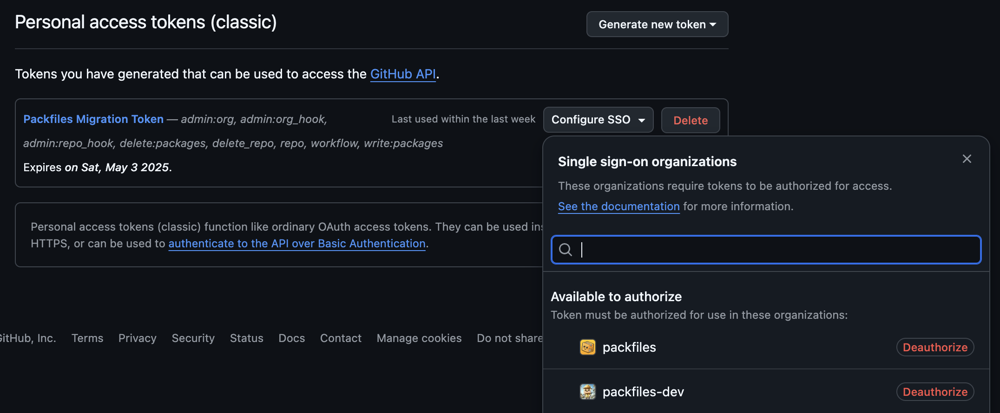

# GitHub (Destination)

The GitHub Destination credential type stores the Personal Access Token and configuration associated with the GitHub Organization or Enterprise to which you're migrating data with Warp.

To configure a GitHub Destination credential, you'll need:

* A Personal Access Token assigned the [correct scopes](get-your-github-credentials.md), 
* The Organization Slug associated with the token, 
* The days until the token expires, and 
* The GitHub Enterprise Cloud product to which you're migrating. 
  * If you're migrating to GitHub Enterprise Cloud with Data Residency, you'll be prompted to provide the tenant URL associated with your Enterprise.

### Configuration



### Get the Organization Slug

🛠️ Switch to the browser tab or window containing _Migration HQ._

Make a note of the URL in your browser’s address bar. The URL contains the _organization slug_, which is the part of the URL that uniquely identifies the organization. It’s the part of the URL after `github.com/` and before `/Migration-HQ`:

<figure><figcaption><p>The browser's address bar,<br>while on the <em>Migration HQ</em> page.</p></figcaption></figure>

In this example, the URL for the organization’s page is:

```
github.com/Hypotheticorp01/Migration-HQ
```

The organization slug is the part that comes after `github.com/` and before `/Migration-HQ`, which means that this example’s organization slug is:

```
Hypotheticorp01
```

🛠️ Copy the organization slug from your browser’s address bar and paste it someplace safe — you’ll use it when you create the vault file.

### Generate a Personal Access Token for Your Account&#x20;

🛠️ Switch to the browser tab or window containing _Migration HQ_ and click on your profile picture (located near the top right of the page) so that this menu appears:

<figure><figcaption><p>The menu that appears when you<br>click your profile picture.</p></figcaption></figure>

🛠️ Select **Settings** from the menu.

You will be taken to the _Settings_ page for your GitHub account:

<figure><figcaption><p>GitHub account <em>Settings</em> page.</p></figcaption></figure>

🛠️ Scroll down the page until you see the **Developer settings** item appear in the list on the left side:

<figure><figcaption><p>GitHub account <em>Settings</em> page, scrolled farther down.</p></figcaption></figure>

🛠️ Click on **Developer settings**.

This will take you to the _Developer Settings_ page:

<figure><figcaption><p>The <em>Developer Settings</em> page.</p></figcaption></figure>

🛠️ In the menu on the left side of the page, expand the **Personal access tokens** item:

<figure><figcaption><p>The <em>Personal access tokens</em> menu.</p></figcaption></figure>

&#x20;🛠️ Select **Tokens (classic)** from the menu.

You will end up at the _Personal access tokens (classic)_ page:

<figure><figcaption><p>The <em>Personal access tokens (classic)</em> page.</p></figcaption></figure>

Towards the top right of the page, you’ll see the **Generate new token** button.

🛠️ Click the **Generate new token** button to make its menu appear:

<figure><figcaption><p>The <em>Generate new token</em> menu.</p></figcaption></figure>

🛠️ ...then select **Generate new token (classic)** from the menu.

You will arrive at the _New personal access token (classic)_ page, where you’ll need to provide enough information to create a new personal access token:

<figure><figcaption><p>The <em>New personal access token (classic)</em> page.</p></figcaption></figure>

🛠️ Enter a name or some other text to help you identify the token in the **Note** field. To make it easier to identify, we suggest you include “Warp” in the name:

<figure><figcaption><p>The <em>Note</em> field and <em>Expiration</em> drop-down menu.</p></figcaption></figure>


For the purposes of this Quickstart, we’ll leave the **Expiration** field at the default value of 30 days.


🛠️ Under **Select scopes**, check the following boxes. Checking these boxes will automatically check their sub-boxes:

* **repo**
* **workflow**
* **write:packages**
* **delete:packages**
* **admin:org**

<figure><figcaption><p>The first set of checkboxes.</p></figcaption></figure>

🛠️  Then scroll down the page and check these boxes. Once again, checking these boxes will automatically check their sub-boxes:

* **admin:repo\_hook**
* **admin:org\_hook**
* **delete\_repo**

<figure><figcaption><p>The next set of checkboxes.</p></figcaption></figure>

Feel free to use the checklist below to double-check that you’ve checked all the necessary checkboxes. It’s important to make sure you’ve checked all of them!

* [ ] **repo**
* [ ] **workflow**
* [ ] **write:packages**
* [ ] **delete:packages**
* [ ] **admin:org**
* [ ] **admin:repo\_hook**
* [ ] **admin:org\_hook**
* [ ] **delete\_repo**

🛠️ Scroll to the bottom of the page and click the **Generate token** button:

<figure><figcaption></figcaption></figure>

You should now see this page, which will display the personal access token you just created:

<figure><figcaption><p>The <em>Personal access tokens (classic)</em> page, with the newly-created Personal Access Token.</p></figcaption></figure>

🛠️ Copy the token and **save it in a safe place** — preferably a password manager.




Depending on your GitHub organization settings, you may also need to authorize your personal access token you issued for your Vault with SSO as well.

Visit [https://github.com/settings/tokens](https://github.com/settings/tokens) and examine the `Configure SSO`dropdown menu adjacent to your personal access token.

<details>

<summary>View screenshot</summary>

<figure><figcaption><p>Personal Access Token SSO Config Menu</p></figcaption></figure>

</details>

If you receive an error like the following`Resource protected by organization SAML enforcement. You must grant your OAuth token access to this organization.` in the terminal or in a runner log, then review your Personal Access Token SSO authorizations as seen above.&#x20;

