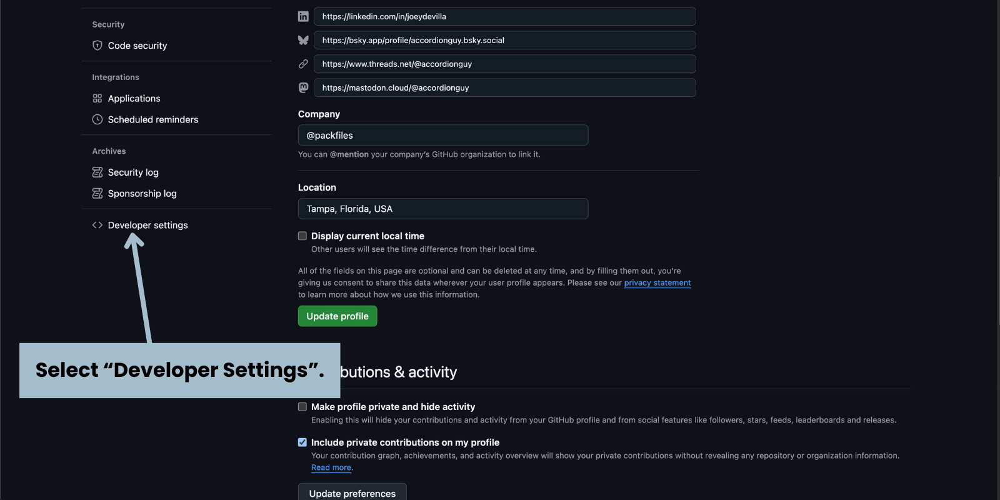
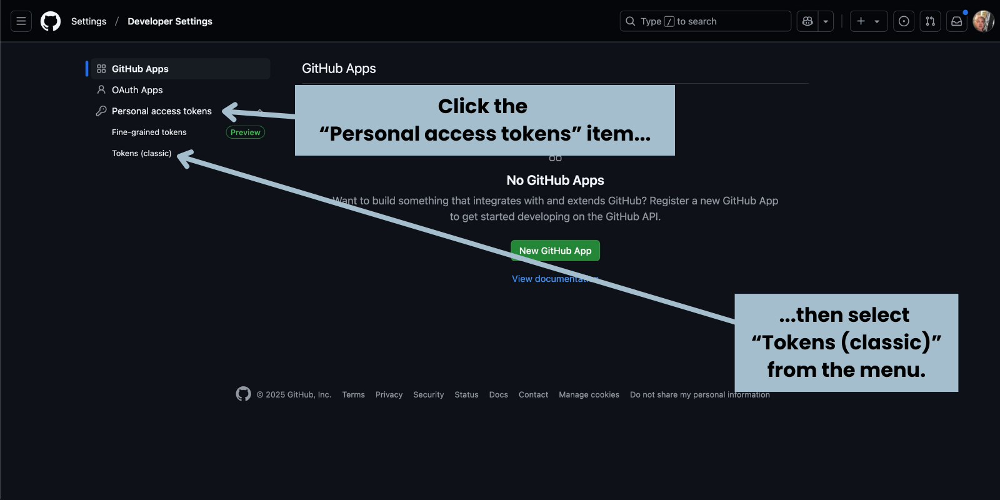
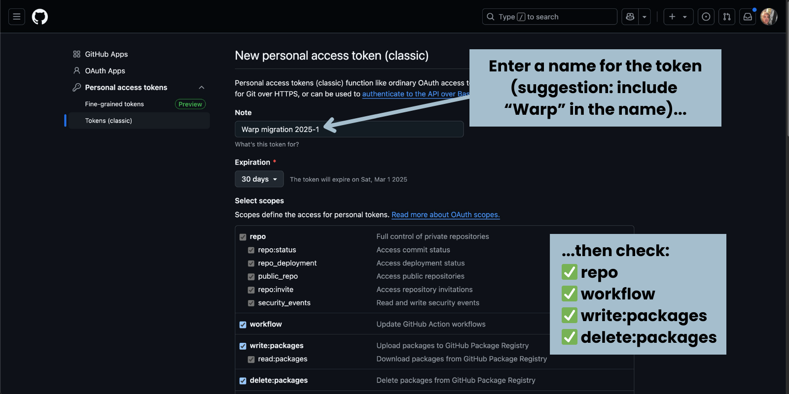

# Get Your GitHub Credentials

For Warp to be able to migrate your repositories to GitHub, it needs two key pieces of information:

1. The destination organization slug, which is the part of the organization’s webpage’s URL that uniquely identifies the organization.
2. A Personal Access Token (PAT) for your GitHub user account, which grants the bearer the necessary privileges to migrate repositories to the organization.

In this section, you will gather these two pieces of information.

### Get the Organization Slug

🛠️ Switch to the browser tab or window containing _Migration HQ._


The example GitHub organization for this quickstart is **Hypotheticorp1234**.


Make a note of the URL in your browser’s address bar. The URL contains the _organization slug_, which is the part of the URL that uniquely identifies the organization. It’s the part of the URL after `github.com/` and before `/Migration-HQ`:

<figure><figcaption></figcaption></figure>

In this example, the URL for the organization’s page is:

```
github.com/Hypotheticorp1234/Migration-HQ
```

The organization slug is the part that comes after `github.com/` and before `/Migration-HQ`, which means that this example’s organization slug is:

```
Hypotheticorp1234
```

🛠️ Copy the organization slug from your browser’s address bar and paste it someplace safe — you’ll use it when you create the vault file.

### Generate a Personal Access Token for Your Account&#x20;

🛠️ Switch to the browser tab or window containing _Migration HQ_ and click on your profile picture (located near the top right of the page), Select **Settings** from the menu that appears:

<figure><figcaption></figcaption></figure>

You will be taken to the _Settings_ page for your GitHub account:

<figure><figcaption><p>How to get to the <em>Developer Settings</em> page.</p></figcaption></figure>

🛠️ In the menu on the left side of the page, click on **Developer settings** (you may need to scroll down a bit).

This will take you to the _Developer settings_ page:

<figure><figcaption><p>Creating a personal access token in GitHub, part one.</p></figcaption></figure>

🛠️ In the menu on the left side of the page, expand the **Personal access tokens** item, then select **Tokens (classic)**.

You will end up at the _Personal access tokens (classic)_ page. Towards the top right of the page, you’ll see the **Generate new token** button:

<figure><figcaption></figcaption></figure>

🛠️ Click the **Generate new token** button, then select **Generate new token (classic)** from the menu that appears.

You will arrive at the _New personal access token (classic)_ page, where you’ll need to provide enough information to create a new personal access token:

<figure><figcaption><p>The top of the <em>New personal access token (classic)</em> page. Make sure you check the indicated boxes!</p></figcaption></figure>

🛠️ Enter a name or some other text to help you identify the token in the **Note** field. To make it easier to identify, we suggest you include “Warp” in the name.


For the purposes of this Quickstart, we’ll leave the **Expiration** field at the default value of 30 days.


🛠️ Under **Select scopes**, check the following boxes, which will appear in this order:

* **repo**
* **workflow**
* **write:packages**
* **delete:packages**

🛠️ There are a few more items to check. Scroll down a little further...

<figure><figcaption><p>Farther down the <em>New personal access token (classic)</em> page. Make sure you check the indicated boxes!</p></figcaption></figure>

🛠️ ...then check the following:

* **admin:org**
* **admin:repo\_hook**
* **delete\_repo**

🛠️ Scroll to the bottom of the page. You’ll see this:

<figure><figcaption></figcaption></figure>

🛠️ Click the **Generate token** button.

You should now see this page, which will display the personal access token you just created:

<figure><figcaption></figcaption></figure>

🛠️ Copy the token and **save it in a safe place** — preferably a password manager.




You now have the information needed to connect Warp to GitHub.

