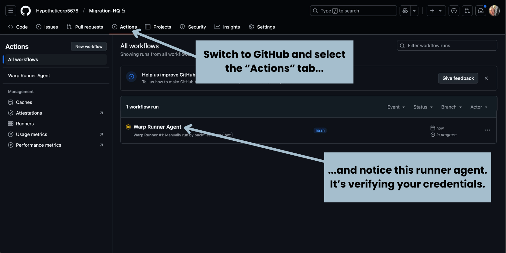
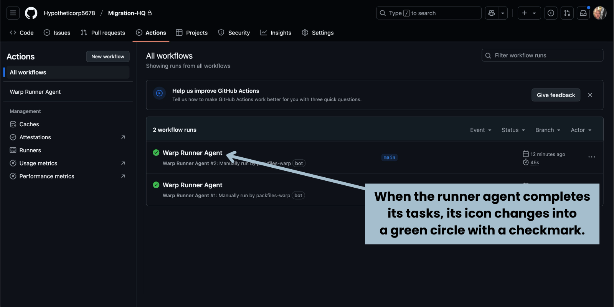

# Scan Your Source for Repositories

### Objective

With your Vault set up, Warp now has the necessary credentials to access both your source repositories and the destination GitHub organization. 

Warp now needs to scan your source to compile a list of repositories for migration. You’ll do this with the Warp web application and look at the results in _Migration HQ_.

**At the end of this section, you will have a list of repositories for migration.**



### Verify Your Credentials

🛠️ Go back to the Warp browser tab or window. It should be on the _Connect Your Sources_ page, which should look like this:

The next step is to connect your Azure DevOps account to Warp. This will allow Warp to access the repositories you want to migrate from Azure DevOps to GitHub.

🛠️ Go back to the Warp browser tab or window. Make sure that you’re on the _Connect Your Sources_ page shown above, then click the **Check Credentials** button near the lower right corner of the page.

The text in the _Verify Credentials_ section will change to “We’re checking your Vault’s credentials. This will take a moment...”:

<figure><figcaption></figcaption></figure>

🛠️ While Warp is examining your vault, switch to the browser tab or window that you were using for the _Migration HQ_ repository in GitHub:

<figure><figcaption></figcaption></figure>

🛠️ Select the **Actions** tab. This will display the list of _Migration HQ_’s workflows.

If you switched to the GitHub browser tab or window and clicked the **Actions** tab quickly enough, you should see a workflow with a spinning yellow icon named **Warp Runner Agent**. The yellow icon denotes that it is currently running. This workflow is using the vault key you stored in _Migration HQ_’s secrets to unlock the personal access tokens for Azure DevOps and GitHub.

<figure><figcaption></figcaption></figure>

🛠️ Wait until the spinning yellow icon is be replaced by a green checkmark. This means that the vault key was successfully used to unlock the personal access tokens for Azure DevOps and GitHub.

🛠️ Switch back to the browser tab or window for Warp:

<figure><figcaption></figcaption></figure>

You should see a section below _Verify Credentials_ titled _Your Vault_. It should contain two items:

* An item representing the Azure DevOps Organization containing the repositories you want to migrate, and
* An item representing the GitHub organization where you want to migrate the repositories.

If you don’t see these items, click your browser’s **Refresh** button.

🛠️ Click the **Next** button.

You’ll arrive at the _All Done!_ page, which marks the end of the process of configuring the project:

<figure><figcaption></figcaption></figure>

### Check the Project’s Status

🛠️ Let’s check the project’s status. Click the **Go to Dashboard** button.

#### Check the Project’s Status

The _Dashboard_ page shows the status of the project you just configured:

<figure><figcaption></figcaption></figure>

The **Trends** section displays the following statistics:

* The number of repositories that Warp found in the Azure DevOps Organization,
* the number of repositories that have been migrated to GitHub,
* the average number of repositories that have been migrated per day, and
* the overall progress of the migration, expressed as a percentage.

The text above the **Trends** section says “Tasks in Progress” and “Scanning your sources...” Warp is scanning your Azure DevOps organization for repositories. Let’s see this process in action.

🛠️ Switch to the browser tab or window for the _Migrations HQ_ repository and select the **Actions** tab:

<figure><figcaption></figcaption></figure>

You should see a new workflow with a spinning yellow icon named **Warp Runner Agent**. The yellow icon denotes that it is currently running. This workflow is scanning the Azure DevOps organization for repositories.

🛠️ Wait for the Warp Runner Agent workflow to start and finish. You’ll know it’s finished when the spinning yellow icon is replaced by a green checkmark. The process may take a few minutes, depending on how many repositories are in your Azure DevOps organization.

<figure><figcaption></figcaption></figure>

🛠️ When the Warp Runner Agent has finished its tasks, switch back to the browser tab or window with the Warp Dashboard:

<figure><figcaption></figcaption></figure>

You should see the updated statistics on the _Dashboard_ page. The number of repositories found in the Azure DevOps Organization should now be displayed.

If you don’t see a count of discovered Azure DevOps repositories, click your browser’s **Refresh** button.

Of course, the best way to prove that Warp has successfully scanned the source and found repositories is to go to _Migration HQ_ and look at the _Issues_ section.

🛠️ Switch to the browser tab or window with _Migration HQ_ and click the _Issues_ tab.

You’ll be taken to _Migration HQ’s_ open issues list:

<figure><figcaption></figcaption></figure>

You’ll see that the number of issues in the list is that same as the number in the _Repositories Discovered_ entry in the Dashboard.

If you take a closer look at the open issues list...

<figure><figcaption></figcaption></figure>

...you’ll see that each issue corresponds to a repository from your source.


You’re so close now — it’s time to [start migrating!](migrate-a-repository.md)

