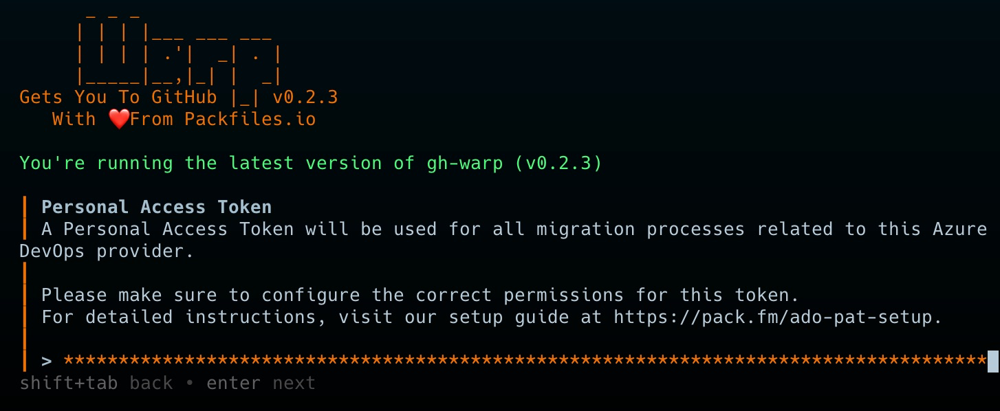
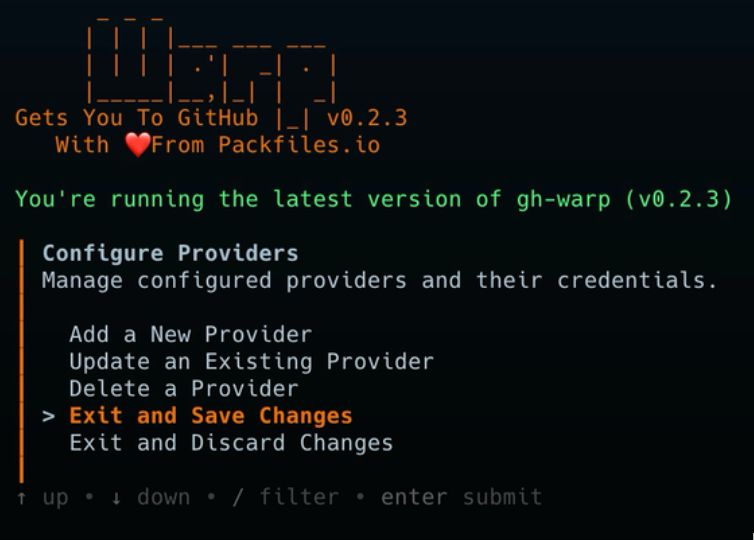
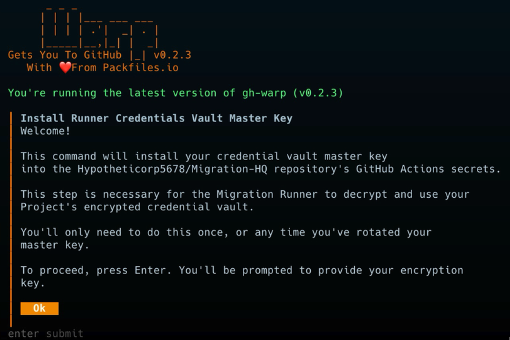
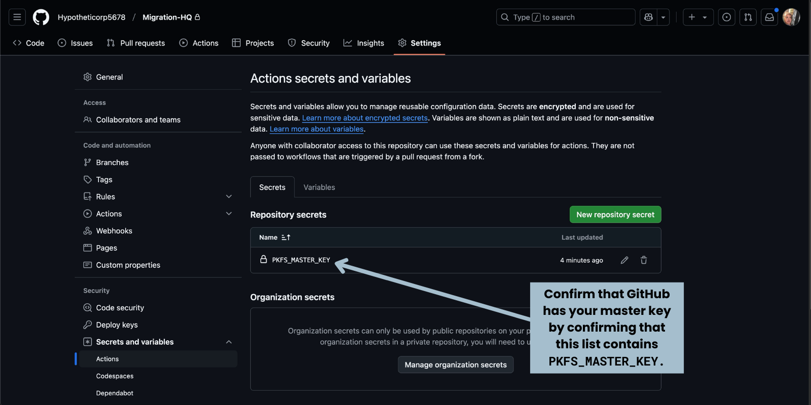

# Set Up the Vault

Now that you’ve gathered your source and destination credentials, you need to make them available to Warp so that it can perform migrations. 

You also need to ensure that these credentials are secured so that only Warp can use them. You’ll do this by setting up a _vault_ — an encrypted file containing the credentials. To decrypt these credentials, you’ll provide Warp with the _vault key_, the decryption key for the vault file.

In this section, you’ll set up the vault by creating the vault file, creating a vault key, pushing the vault file to _Migration HQ_, and installing the vault key as a secret in _Migration HQ_. You’ll do all this by using the GitHub CLI application and the Warp command-line extension.

🛠️ Open a command-line terminal on your computer, using the _Terminal_ application on macOS or Linux, or _Command Prompt_ or _PowerShell_ on Windows and change to the directory containing the cloned _Migration HQ_ repository.

🛠️ Run the following command, which starts the Warp command-line application that sets up the vault:

```bash
gh warp vault setup
```

You will see the “Welcome” text pictured below:

<figure><figcaption><p>The “Welcome†page of the <em>Vault Setup</em> application.</p></figcaption></figure>

🛠️ Press the **Enter** or **Return** key to continue.

You will see the _Configure Providers_ menu, which lets you add, update, and delete tokens for various source control providers:

<figure><figcaption><p>The main menu of the <em>Vault Setup</em> application.</p></figcaption></figure>

🛠️ The default option, **Add a New Provider**, is the one you want. Press the **Enter** or **Return** key to select this option.

<figure><figcaption><p>The <em>Add Provider Credentials</em> menu of the <em>Vault Setup</em> application, with <em>Azure DevOps</em> selected.</p></figcaption></figure>

🛠️ Let’s add the personal access token for Azure DevOps first. Since **Azure DevOps** is the default option, simply press the **Enter** or **Return** key to select it.

You’ll see this text, which explains that you’re about to configure an Azure DevOps provider:

<figure><figcaption><p>The <em>Configure an Azure DevOps Provider</em> screen of the <em>Vault Setup</em> application.</p></figcaption></figure>

🛠️ Press the **Enter** or **Return** key to continue.

You will now be prompted to enter the personal access token you created in Azure DevOps:

<figure><figcaption><p>The <em>Personal Access Token</em> screen for Azure DevOps in the <em>Vault Setup</em> application.</p></figcaption></figure>

🛠️ Paste your Azure DevOps personal access token into the text area marked **Your PAT**...



🛠️ ...then press the **Enter** or **Return** key to continue.

The next step is to specify the access scope for the Azure DevOps personal access token:

<figure><figcaption><p>The <em>Access Scope</em> menu of the <em>Vault Setup</em> application.</p></figcaption></figure>

🛠️ Select **Single organization access** using the ⬆️ and ⬇️ keys, then press the **Enter** or **Return** key.

You’ll be asked to enter the Azure Devops organization slug, which you copied when you were creating the personal access token for your Azure DevOps organization. In this example, the slug is `joey-ado-testing`:


🛠️ Paste or enter the organization slug into the text area marked **ado-organization-slug**...


🛠️ ...then press the **Enter** or **Return** key to continue.

You’ll then be asked to specify the number of days until the token expires:


🛠️ Enter **30**, then press the **Enter** or **Return** key.

Finally, you’ll be asked to confirm the information you’ve entered:


🛠️ Press **y** to confirm that the information is correct.

It’s time to add the personal access token for GitHub. You’ll see the _Configure Providers_ menu again:

<figure><figcaption><p>The main menu of the <em>Vault Setup</em> application.</p></figcaption></figure>

🛠️ Once again, the default option, **Add a New Provider**, is the one you want. Press the **Enter** or **Return** key to select this option.

![The Add Provider Credentials menu of the Vault Setup application, with GitHib \[Destination\] selected.](../../media/images/quickstart/vault_setup/vault_setup_select_add_github_credentials.png)

🛠️ Select **GitHub \[Destination]** using the ⬆️ and ⬇️ keys, then press the **Enter** or **Return** key.

You’ll see this text, which explains that you’re about to configure a GitHub destination:


🛠️ Press the **Enter** or **Return** key to continue.

You will now be prompted to enter the personal access token you created in GitHub:

<figure><figcaption><p>The <em>Personal Access Token</em> screen for GitHub in the <em>Vault Setup</em> application.</p></figcaption></figure>

🛠️ Paste your GitHub personal access token into the text area marked **Your PAT**...

<figure><figcaption><p>The <em>Personal Access Token</em> screen for GitHub in the <em>Vault Setup</em> application, with the token pasted in.</p></figcaption></figure>

🛠️ ...then press the **Enter** or **Return** key to continue.

You’ll be asked to enter the GitHub organization slug, which you copied when you were creating the personal access token for your GitHub organization.

<figure><figcaption><p>The GitHub <em>Organization Slug</em> screen of the <em>Vault Setup</em> application.</p></figcaption></figure>

In this example, the slug is `Hypotheticorp5678`:

<figure><figcaption><p>The GitHub <em>Organization Slug</em> screen of the <em>Vault Setup</em> application, with the organization slug pasted in.</p></figcaption></figure>

🛠️ Paste or enter the organization slug into the text area marked **destination-organization-slug**, then press the **Enter** or **Return** key to continue.

You’ll then be asked to specify the number of days until the token expires:


🛠️ Enter **30**, then press the **Enter** or **Return** key.

Finally, you’ll be asked to confirm the information you’ve entered:

<figure><figcaption><p>The <em>Confirmation</em> screen for the GitHub token in the <em>Vault Setup</em> application.</p></figcaption></figure>

🛠️ Press **y** to confirm that the information is correct.

You will return to the _Configure Providers_ menu.

<figure><figcaption><p>The main menu of the <em>Vault Setup</em> application, with Exit and Save Changes selected.</p></figcaption></figure>

🛠️ Select **Exit and Save Changes** using the ⬆️ and ⬇️ keys, then press the **Enter** or **Return** key.

This will create the vault file, which needs to be committed and pushed to the _Migration HQ_ repository. You will see this prompt:

<figure><figcaption><p>The <em>Commit and Push Changes</em> screen of the <em>Vault Setup</em> application.</p></figcaption></figure>

🛠️ Use the default option, **Yes**, then press the **Enter** or **Return** key.

You will see the _Save Your Vault Key_ prompt:


🛠️ Just as you did with the personal access token in Azure DevOps and GitHub, copy the vault key and save it in a safe place — preferably a password manager. You will need it to unlock the personal access tokens that were encrypted into the vault.

🛠️ After you have copied and saved the vault key, press the **Enter** or **Return** key to continue.

You’ll see the final message:


At this point:

* The Azure DevOps and GitHub personal access tokens have been encrypted into the vault file (`config/vault.age` on macOS and Linux, `config\vault.age` on Windows)
* The vault file has been committed and pushed to the _Migration HQ_ repository.

#### Store the Vault key in _Migration HQ_

The next step is to store the key for the vault file in the _Migration HQ_ repository. This will allow the Warp GitHub Actions to access the personal access tokens you encrypted into the vault, which in turn will allow them to migrate your repositories from Azure DevOps to GitHub.

You _could_ do this manually by copying the vault key and pasting it into the _Migration HQ_ repository’s _Secrets_ section. However, Warp provides a command-line application that will do this for you. Let’s use it.

🛠️ Run the following command, which starts the Warp command-line application that stores the vault key in the _Migration HQ_ repository:

```bash
gh warp vault place
```

You’ll be greeted with the following text:



🛠️ Press the **Enter** or **Return** key to continue.

You’ll be prompted to enter your vault key:


🛠️ Paste the vault key into the text area...


🛠️ ...then press the **Enter** or **Return** key to continue.

The app will store your vault key into the _Migration HQ_ repository’s secrets and display this message:


You should confirm that your vault key was successfully stored in _Migration HQ_ by checking the repository’s _Secrets_ section in GitHub:


🛠️ Open a browser tab or window to the _Migration HQ_ repository in GitHub and click the **Settings** tab.

🛠️ In the menu on the left side of the page, select **Secrets and variables** to expand it, then select **Actions**.

You should see the _Actions secrets and variables_ page for _Migration HQ_ :



🛠️ Check the _Repository secrets_ section and confirm that it contains a secret named `PKFS_MASTER_KEY`.

If you see the `PKFS_MASTER_KEY` secret, you have successfully stored the vault key in _Migration HQ_. If not, you should run the `gh warp vault place` command again.
