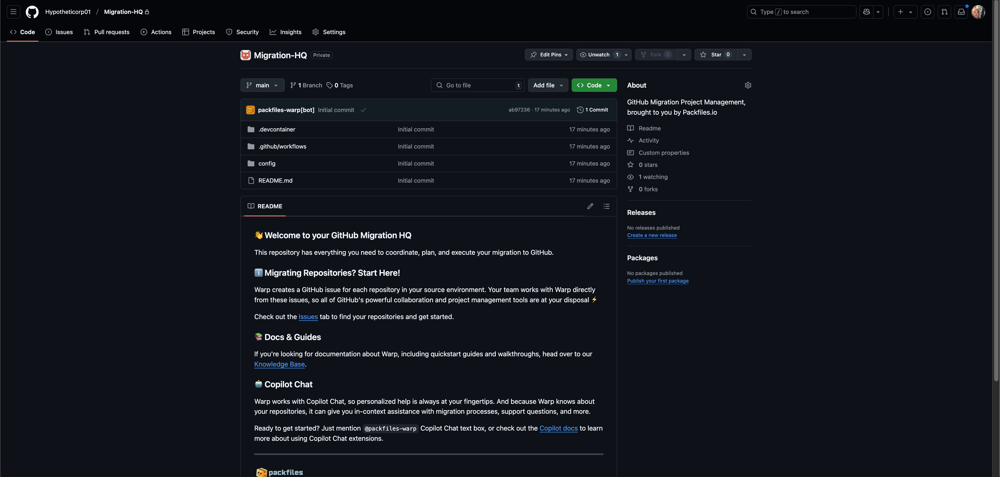

# Set Up Your Project

### Objective

In Warp, a _**Project**_ is an object for managing the migration of repositories to GitHub. Typically, you’ll create a new project for a specific _migration engagement_, such as moving a collection of repositories for an organization, department, team, or development project.

In this section, you’ll set up a Project by creating it, installing the Warp GitHub app for the organization, and configuring the Project.

**At the end of this section, you will have a new Warp project.**



### Sign In to the Warp Web Application

🛠️ Open a browser tab or window to the [Warp web application](https://warp.packfiles.io) at [warp.packfiles.io](https://warp.packfiles.io):

<figure><figcaption>
Warp’s <em>sign in</em> page, located at <a href="https://warp.packfiles.io/">warp.packfiles.io</a>.
</figcaption></figure>

🛠️ Click the **Sign in with GitHub** button and sign in to Warp using your GitHub account.

### Create a New Project

Upon signing in, you will be taken to Warp’s _Projects_ page, which lists your current migration projects:

<figure><figcaption>
Warp’s <em>Projects</em> page, which you’ll see immediately after signing in.
</figcaption></figure>

At the bottom of the list of projects, you’ll see the **Create a New Project** area.

🛠️ Click anywhere on **Create a New Project** area to expand it.

The **Create a New Project** area will expand to display instructions for what to do next:

<figure><figcaption>
The <em>Create a New Project</em> area, after you’ve expanded it.
</figcaption></figure>

🛠️ Click the **Install Warp from the GitHub Marketplace** button.

### Install Warp’s Github App

A new browser will open to the [GitHub Marketplace page for Warp’s GitHub app](https://github.com/marketplace/packfiles-warp):

<figure><figcaption>
The Warp app’s page in GitHub Marketplace.
</figcaption></figure>

🛠️ Click the **Add** button near the upper right corner of the page or scroll to the bottom of the page. You should see the following:

<figure><figcaption>
The Warp app’s page in GitHub Marketplace, scrolled to the bottom.
</figcaption></figure>

At the bottom of the page, you’ll see the **Account** drop-down menu and the **Install it for free** button:

<figure><figcaption></figcaption></figure>

🛠️ In the **Account** menu, select the account for the destination organization — that is, the organization that you will be migrating repositories to.


The example destination organization for this quickstart is **Hypotheticorp01**.


🛠️ Click the **Install it for free** button.

You’ll be taken to the **Review Your Order** page:

<figure><figcaption>
The <em>Review Your Order</em> page in GitHub Marketplace.
</figcaption></figure>

🛠️ Review the order, then click the **Complete order** button.

You’ll go to the _Install Packfiles Warp_ page, which will show:

* That the Warp GitHub app will have access to all the repositories in the organization, and
* What read, read/write, and admin permissions it will have within the organization and its repositories.

<figure><figcaption>
The <em>Install Packfiles Warp</em> page in GitHub.
</figcaption></figure>

🛠️ Click the **Install** button at the bottom of the page.&#x20;

You will return to the Warp web app, and can proceed to the next step.

### Configure the Project

You will be at the _Welcome to Warp_ page:

<figure><figcaption>
The <em>Welcome to Warp</em> page.
</figcaption></figure>

🛠️ Click the **Next** button.

This will take to you the _Configure Your Project_ page:

<figure><figcaption>
The <em>Configure Your Project</em> page.
</figcaption></figure>

You can do two things on this page:

1. You can set the name of your project, or choose to keep the default name.
2. You can invite people on your team to become members of the project.


As the creator of the project, you don’t have to add yourself to the team. You are already a member of the project with _Admin_ access.


🛠️ For this Quickstart, simply click the **Next** button.

You will arrive at the _Connect Your Sources_ page. You’ll use it in the process of connecting your source and GitHub accounts to Warp:

<figure><figcaption>
The <em>Connect Your Sources</em> page.
</figcaption></figure>

When you created the project, Warp created a repository named _Migration HQ_ for the GitHub organization that you selected earlier. _Migration HQ_ will be the user interface for managing your migrations. It will be where you issue commands to Warp and it will keep track of which repositories to migrate and which ones have already been migrated.

🛠️ Let’s visit _Migration HQ_. Click the **Migration HQ** button, located in the _Set Up Your Vault_ section:

<figure><figcaption></figcaption></figure>

A new browser tab or window will open, and you should see the _Migration HQ_ page:

<figure><figcaption>
The <em>Migration HQ</em> page for your project.
</figcaption></figure>

The files contained in _Migration HQ_ are configuration and credentials files that Warp will use in the migration process. You will need to clone _Migration HQ_ to your local computer, where you will create a _vault file_ containing the following:

* Credentials for accessing the repositories at the source (the place where you are migrating repositories _from_).
* Credentials for accessing the destination GitHub organization (the place where you are migrating repositories _to_).

After creating the vault file, Warp will automatically push it to _Migration HQ_, making the credentials available to Warp, enabling it to migrate your repositories.

🛠️ Clone the _Migration HQ_ repository to your local computer.


You’ve successfully set up your project — nicely done!

Make sure that you’ve cloned _Migration HQ_ to your local computer, then [proceed to the next step.](gather-your-credentials/)


