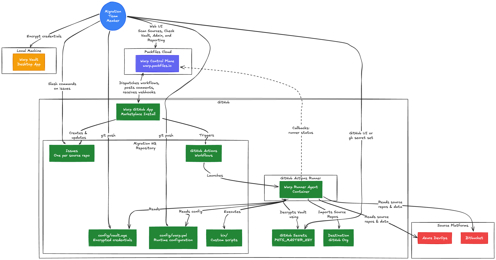

# What's Warp?

Warp is a next-generation solution for organizations seeking to adopt GitHub's products. It's designed by [Packfiles](https://packfiles.io) to unlock speed, efficiency, and collaboration across the entire journey of migrating their data, development processes, and teams away from their original platform and onto the latest and greatest tools available.

Warp is composed of multiple components that all work together to coordinate your migration to GitHub.

The first component is the [Warp GitHub App](https://pack.fm/warp) that can be installed directly from the GitHub Marketplace, with a fully self-service setup and configuration process that takes less time than going to lunch. And because Warp includes a [built-in free trial](../billing-and-licensing/free-tier.md), it's easy for teams to assess Warp's capabilities flexibly, on their own schedule, and with no upfront financial commitments.

The second component is the [Warp Control Plane](https://warp.packfiles.io), a web application that communicates with the Warp GitHub App to perform work on your behalf. The control plane also provides reporting tools, migration team member management, and other admin tools.

The third component is the [Warp Runner Agent](../using-warp/migration-hq/runner-agent.md) that operates on GitHub runners in your environment either GitHub cloud or self-hosted. Runner Agents have all of the tools needed to perform migration operations on your behalf at your request and are coordinated by the control plane.

The fourth component is the [Warp Vault](../using-warp/warp-vault/README.md), a desktop application that keeps your credentials encrypted while in the Migration HQ repository. Only the Runner Agent can decrypt your `vault.age` file at runtime (and only with the your vault master key stowed in [GitHub's repository secrets](https://docs.github.com/en/actions/how-tos/write-workflows/choose-what-workflows-do/use-secrets#creating-secrets-for-a-repository)).

The last component is the Migration HQ repository that Warp automatically generates during the Warp installation and configuration process of your migration project. It's here in the Migration HQ repository that you can update the runtime configuration settings for Warp Runner Agents (see the [warp.yml](../using-warp/migration-hq/warp.yml.md) file). Warp will create a [GitHub Issue for each git repository in your source](../using-warp/migration-hq/issues/README.md) (e.g., ADO Organization). From there you can plan, coordinate, and collaborate on your migration to GitHub.

The following diagram shows how these components fit together:

Warp has everything you need to achieve success on your migration journey, including:

* [Advanced security features](../security/warp-security-model/) that are seamless, easy to use, mitigate risk, and respect your privacy,&#x20;
* A fair, flexible, and transparent [licensing model](../billing-and-licensing/overview.md) with no surprises,&#x20;
* Built in [reporting](../using-warp/projects/dashboard.md) and [project management](../using-warp/migration-hq/issues/) tools that make work visible, collaborative, and straightforward to plan,
* A [GitHub-native experience](../using-warp/migration-hq/) that lets your team use the tools they already know and love, and
* A wide range of available [support options](../using-warp/support/) to assure the success of your team, directly from [our team](../using-warp/support/#product-support) and from our [expert partners](../using-warp/support/partners.md).
