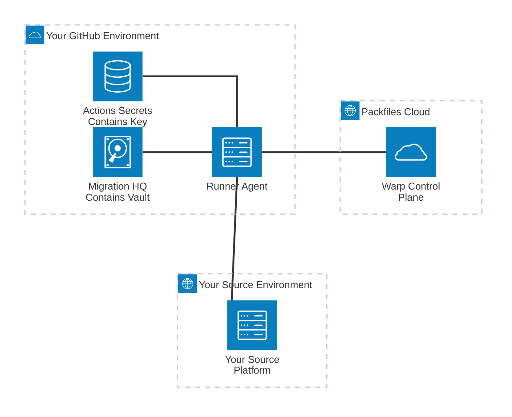

# Warp's Security Model

Much has been said about "Zero-Trust" security architecture, but in practice, few vendors are able to truly deliver on that vision. Doing so requires a deep commitment to protecting the security and confidentiality of customer data, along with the drive and technical skill needed to solve the host of engineering challenges that make it possible to deliver scalable, resilient systems with these properties.&#x20;

When we originally set out to design Warp, we were met with the following security challenges:

* Most migration tools, including first-party tools published by GitHub, require a combination of many highly privileged credentials to perform their work.
* Any individual operating migration tools, whether for their own use or on behalf of another organization, is required to have the administrative access mentioned previously to carry out these migration tasks.
* Organizations are increasingly concerned about the collection, storage, and processing of their data. Because migrations necessarily involve the processing of nearly all an organization's software artifacts, including those of a business-critical or trade-secret nature, customers require the utmost transparency, security, and governance of these processes.

Based on these challenges, we identified the following key problems to solve:

* Storing and managing credentials securely,&#x20;
* Executing migration tools without compromising the confidentiality of credentials, and&#x20;
* Ensuring the confidentiality, integrity, and privacy of customer data.

### Credential Management&#x20;

To solve the problem of securing the management and storage of credentials, we built our own credential manager known as the **Vault**.

**When you use Warp, your credentials, along with the key used to encrypt the Vault that contains them, are never known to Packfiles.** Your key material is maintained exclusively in your GitHub environment, on infrastructure you control, and is never stored or processed on Packfiles' infrastructure or accessible by our staff.

To learn more about the Vault, have a look at the [Credential Management](credential-management.md) section.

### Private Compute

To execute migration tools and processes securely, while also placing control in the hands of our customers, we designed the [Warp Runner Agent](../../using-warp/migration-hq/runner-agent.md).&#x20;

The Warp Runner Agent is the muscle of our migration platform. It's the only component of Warp that's responsible for&#x20;

### Data Privacy&#x20;

We've taken strong and intentional steps to ensure the confidentiality and privacy of our customers' data. Review the [Data Privacy](./#data-privacy) section to learn about our commitments and safeguards.
