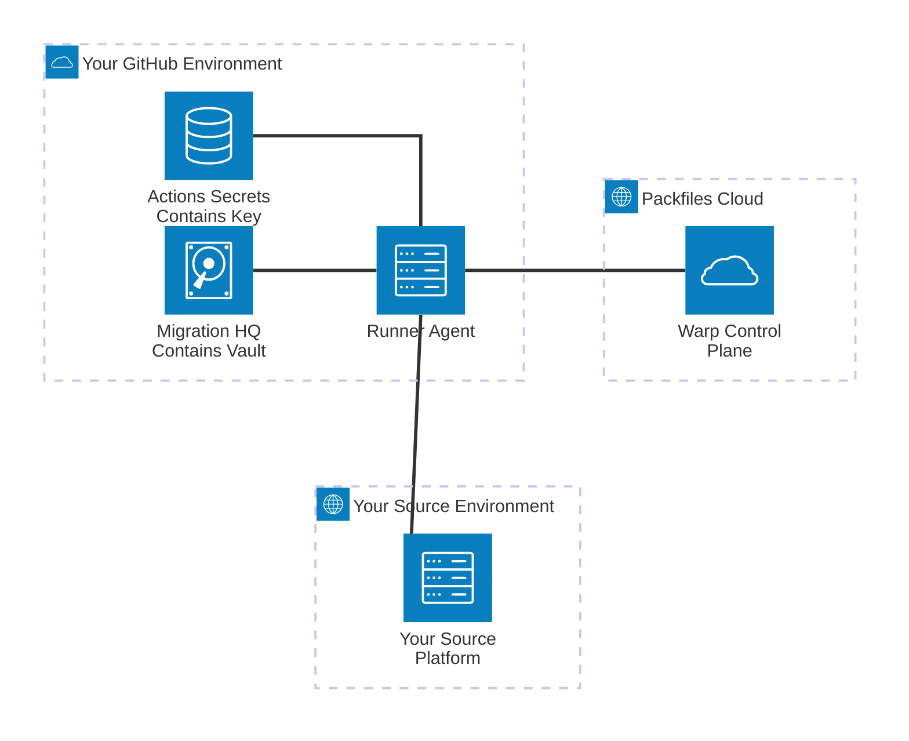

# Warp's Security Model

### Introduction

Packfiles designs security into the core of our products. As part of our mission to create the world's leading platform for Enterprise-scale GitHub adoption, we cannot understate the importance of protecting our customers, their data, and the trust they have placed in us.

Packfiles' ultimate goal is to keep our customers safe. We achieve this with a combination of technologies, architectural choices, and best practices that work together to deliver a user experience that is as approachable and transparent as it is maximally secure.

Key security features, such as [customer-owned key management](key-management.md), [private data processing](data-privacy.md), and [data minimization](data-privacy.md) can't be disabled or configured improperly by mistake. Because these features are inherently part of Warp's design, customers don't need to perform extensive or complicated configurations to enjoy the benefits of these protections. They're always present and active for Projects of any size.

### Our Principles

At Packfiles, we believe security _defines_ our products. It's not just a product feature. That's why we always start our design process by thinking about how new products and features fit into our values and security principles.

We believe:

#### **Effective security is accessible by design.**

The best security technologies are transparent and easy to use.&#x20;

#### **"Secure by design" is better than "secure by default"**&#x20;

Or even "secure with a bit of extra configuration".

### Warp's Security Architecture

Much has been said about "Zero-Trust" security architectures. But in practice, few vendors are truly able to deliver on that vision. Doing so requires a deep commitment to protecting the security and confidentiality of customer data, along with the drive and technical skill needed to solve the host of engineering challenges that make it possible to deliver scalable, resilient systems with such properties.&#x20;

When we originally set out to design Warp, we were met with the following security challenges:

* Most migration tools, including first-party tools published by GitHub, require a combination of highly privileged administrative credentials to perform their work.
* Any individual operating migration tools, whether for their own use or on behalf of another organization, is required to have the administrative access mentioned previously to carry out these migration tasks.
* Organizations are increasingly concerned about the collection, storage, and processing of their data. Because migrations necessarily involve the processing of nearly all an organization's software artifacts, including those of a business-critical or trade-secret nature, customers require the utmost transparency, security, and governance of these processes.

PKFS security controls technical description

PKFS security audits and in house expertise
