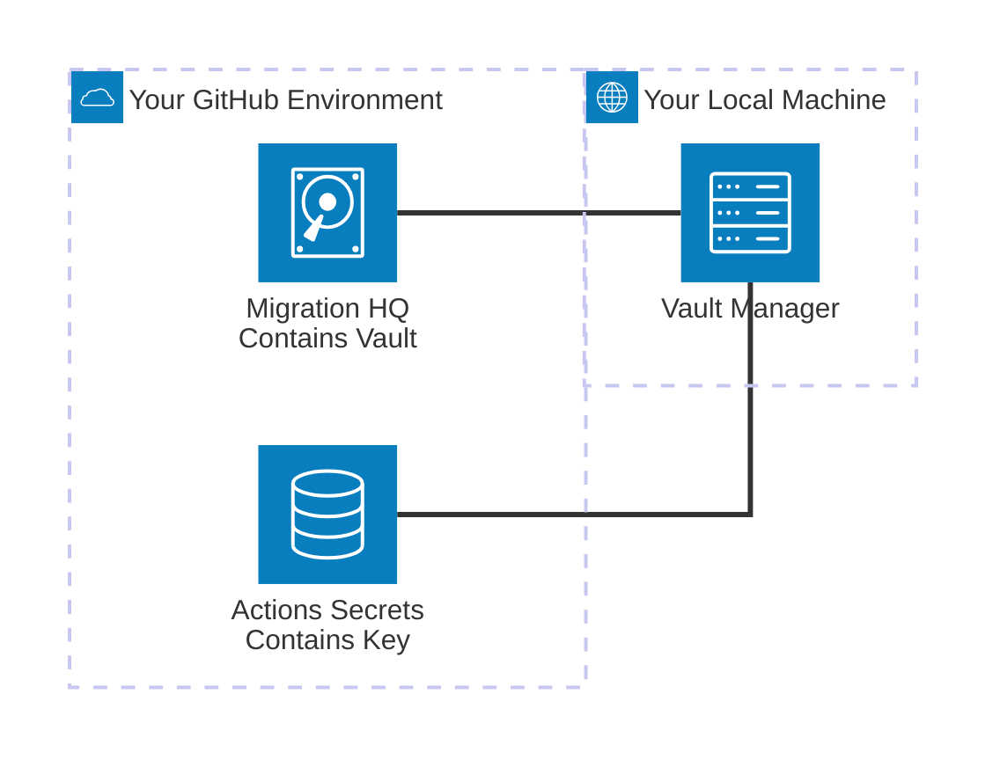

# Credential Management

### Overview

To facilitate the secure storage and retrieval of credentials required for migrations, Packfiles has designed a credential management application specifically for Warp known as the **Vault**, which protects your key material with end-to-end encryption.

**When you use Warp, your credentials, along with the key used to encrypt the Vault that contains them, are never known to Packfiles.** Your key material is encrypted and maintained exclusively in your GitHub environment, on infrastructure you control, and is never stored or processed on Packfiles' infrastructure or in a form accessible by our staff.

Packfiles expects customers to designate a trusted administrator in their organization with the responsibility of populating and maintaining the Vault's contents. Management of the contents of the Vault occurs on an administrator's local machine via a native application, and internet connectivity is not required or used for this process.&#x20;

When the individual responsible for maintaining a Vault creates or modifies its contents, encryption is performed on their local machine with a randomly generated **Master Key**. This key is generated on the local machine of the individual managing the vault, is unique to each Project, and is never shared with Packfiles.

A Vault's contents, and the **Master Key** used for encryption, are maintained in custody of the customer. Customers are expected to maintain their Master Key in a secure location, such as a password manager, and in their Migration HQ repository's GitHub Actions secrets. Packfiles does not store or manage the Master Key of the Vault at any time.&#x20;

### Technical Description

The encrypted contents of the Vault are stored in a file located in your Migration HQ repository on GitHub. This follows GitHub's [published best practice](https://docs.github.com/en/actions/security-for-github-actions/security-guides/using-secrets-in-github-actions#storing-large-secrets) for storing large secrets on their platform.&#x20;

The Vault uses the [age](https://github.com/FiloSottile/age) encryption library to provide its underlying cryptography. A detailed specification outlining the cryptographic primitives used by age is available [here](https://age-encryption.org/v1).

#### Architecture Diagram

