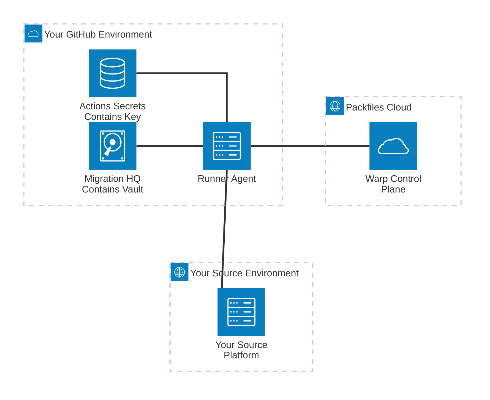

# Private Compute

When you use Warp to invoke any process that operates on your source environment, it's carried out by the Warp Runner Agent. The Warp Runner Agent is the "muscle" of our migration platform, and it's the only component of Warp responsible for invoking migration tools and connecting to your source environment.&#x20;

**The Warp Runner Agent executes exclusively in your environment, on infrastructure you own and control.** Although Packfiles is responsible for developing, packaging, and distributing the software that constitutes the Agent, the Agent itself is never executed on our infrastructure. This reduces potential attack surface considerably, providing an exceptional level of isolation and ensuring that Packfiles and its staff cannot directly access your source environment, your credentials, or otherwise impact the confidentiality or integrity of the data you're migrating.

#### Lifecycle & Technical Description

The Runner Agent communicates with Warp's **Control Plane** to exchange status information and coordinate its work while minimizing the exposure of data about your environment.&#x20;

Processes carried out by the Warp Runner Agent follow a set lifecycle:

* When a job is scheduled on behalf of a Warp customer, the Control Plane dispatches a GitHub Actions workflow maintained in the customer's Migration HQ repository.
* GitHub Actions executes the workflow, which calls Packfiles' [runner-agent](https://github.com/packfiles/runner-agent) action and supplies the following inputs:
  * An ephemeral API token for the Warp Control Plane, whose permissions are restricted specifically to that job,
  * A checked-out clone of the Migration HQ repository's Git contents, and&#x20;
  * The Credential Vault master key, which is maintained in the Migration HQ repository's GitHub Actions secrets.
* The runner-agent action retrieves the Warp Runner Agent container image from Packfiles' container registry, and initializes it with the data mentioned in the previous step.
* The Warp Runner Agent container is started, and the Agent is initialized by a supervisor process. This process exchanges metadata about the container's environment and retrieves information about the job to be performed via authenticated requests to Warp's Control Plane API.
* The Agent carries out the requested job, and reports status information to the Control Plane over the course of that job's lifecycle.&#x20;
* Upon completion of the job, the Warp Runner Agent reports its status to the Control Plane, and uploads its logs and artifacts to GitHub Actions Artifacts.&#x20;
  * As an additional layer of security, all logs and artifacts produced by the Agent are scanned by a scrubber process to prevent the [inadvertent exposure of key material](https://github.com/github/gh-gei/issues/1151) by its subprocesses.
* The ephemeral API token for the job is revoked upon successful completion of the job.&#x20;
  * As a failsafe measure, the token is purged if the supervisor process crashes, or when the token's lifespan reaches its limit.

#### Architecture Diagram

