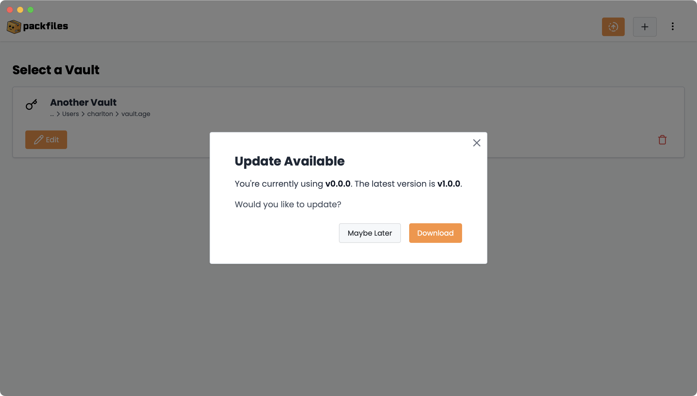

# Issues

The _Issues_ page of _Migration HQ_ is the list of the Project’s migrations. For each repository that Warp finds in the sources you provide (e.g. Azure DevOps), it creates an issue representing that repository:

<figure><figcaption></figcaption></figure>

### Viewing Open Issues

**When you open&#x20;**_**Migration HQ**_**’s&#x20;**_**Issues**_**&#x20;page, you will see the open issues list, which GitHub displays by default.** Items in the open issues list correspond to repositories that have not yet been migrated:

<figure><figcaption>
The <strong>open issues list</strong> in the <em>Issues</em> page, which displays the Project repositories that have not been migrated.
</figcaption></figure>

**To view an open issue, click its name.** You will be taken to its issue page, which will display its details, and which you can use to issue commands, including the command to start a migration.

You can filter _Migration HQ_ issues in the same ways you would in a standard GitHub repository: by open/closed status, author, label, and so on.

### Viewing Closed Issues

Items in the closed issues list correspond to repositories that have either been migrated or ignored:

<figure><figcaption>
The <strong>closed issues list</strong> in the <em>Issues</em> page, which displays the Project’s migrated and ignored repositories.
</figcaption></figure>

**To view an closed issue, click its name.** You will be taken to its issue page, which will display its details, including information about the migration.

### Closing Issues

There are two ways to close an open issue in _Migration HQ:_

1.  **Automatically.** After a successful migration of a repository to GitHub, Warp changes the status of its corresponding issue to _Closed_. The issue will move from the open issues list to the closed issues list, and the _Closed_ indicator will appear below the title of its page:\

    <figure><figcaption></figcaption></figure>
2.  **Manually.** You can close one or more issues manually by checking their boxes in the open issues list and selecting either **Completed** or **Not Planned** from the **Mark as** menu:\

    <figure><figcaption></figcaption></figure>

    You can also manually close an issue on its own page — see [_Issue Page_](issue-page.md) for details.\
    \
    **By closing an issue manually, you are choosing to&#x20;**_**ignore**_**&#x20;the repository.** Ignoring a repository has these effects:

    * It moves the issue to the closed issues list.
    * Warp will ignore any slash commands (commands that you issue to Warp) entered into the issue’s comments and it will not update the issue’s content.

### Re-opening Issues

If you decided that you need to re-migrate a repository, you can do so by re-opening its issue. You can re-open one or more issues by checking their boxes in the closed issues list and selecting either **Open** from the **Mark as** menu:

<figure><figcaption></figcaption></figure>

Re-opening an issue has these effects:

* It moves the issue to the open issues list.
* Warp will once again pay attention to slash commands entered into the issue’s comments and will update the issue’s content as its status changes.

