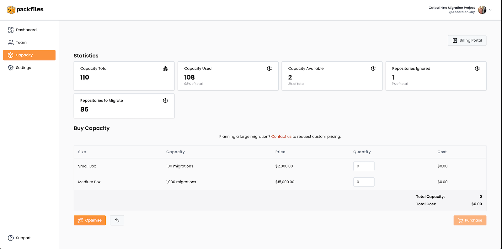

# Capacity

<figure><figcaption></figcaption></figure>

The _Capacity_ page displays your Project’s _capacity_ — the number of migrations that have been allocated to your Project — and related statistics. Each migration costs one unit of capacity. You can also purchase more capacity for the Project account on this page.

The key parts of the _Capacity_ page are described in detail below.

### Billing Portal

<figure><figcaption></figcaption></figure>

The **Billing Portal** button takes you to the Warp Billing Portal, where you can do the following:

* View and manage your payment methods.
* View and manage your billing contact information.
* View your invoice history.

### Statistics

<figure><figcaption></figcaption></figure>

The _Statistics_ section provides the following quantitative information about your Project:

* **Capacity Total:** The total amount of capacity purchased for the Project. For every migration, one unit of capacity must be spent.
* **Capacity Used:** The total number of capacity units used by the Project. Each unit represents one successful migration.
* **Capacity Available:** The amount of capacity remaining for the Project. You can perform one migration for each one of these units. \
  &#xNAN;_(The formula is: Capacity Available = Capacity Total - Capacity Used)_
* **Repositories Ignored:** The total number of repositories that you have intentionally ignored (excluded from migration) in the Project.
* **Repositories to Migrate:** The number of repositories that still need to be migrated.\
  &#xNAN;_(The formula is: Repositories to Migrate = Discovered Repositories - Migrated Repositories - Ignored Repositories)_

### Buy Capacity

<figure><figcaption></figcaption></figure>

The _Buy Capacity_ section lets you purchase additional capacity for the Project. It has the following functions:

* It lists the prices for the various _boxes_, which are “packages” of capacity for purchase.&#x20;
* It gives you the ability to set the amount of capacity to purchase. You can set this amount in a couple of ways:
  * By entering a quantity in the **Quantity** field for the **Small Box**, **Medium Box**, or both rows.
  * You can click the **Optimize** button, which automatically enters the optimal quantities for purchasing enough capacity to handle your remaining repositories to migrate. You can clear the effects of the **Optimize** button by clicking the  button.
* You can start the purchase process by clicking the **Purchase** button. This will take you to the checkout page, where you will specify the payment method and finalize your purchase.

### Available Box Sizes



