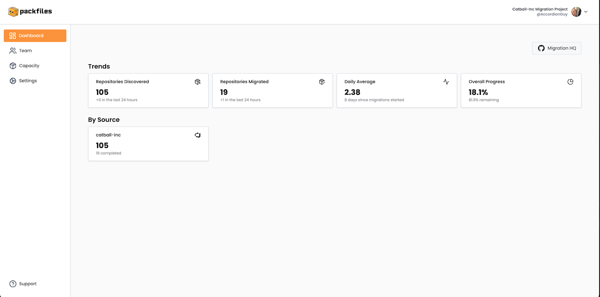
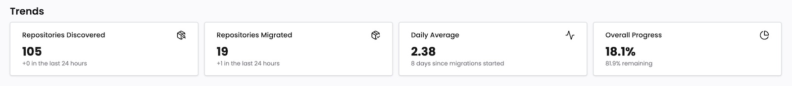

# Dashboard

<figure><figcaption>
Warp’s <em>Dashboard</em> page.
</figcaption></figure>

The Dashboard is purposely designed to be simple, providing a high-level overview of the project’s size and progress.

### Migration HQ

<figure><figcaption></figcaption></figure>

The **Migration HQ** button takes you to the _Migration HQ_ repository for this project. This repository acts as the control panel for the migration process.

### Trends

<figure><figcaption></figcaption></figure>

The _Trends_ section provides the following quantitative information about your project:

* **Repositories Discovered:** The number of repositories that Warp was able to find after scanning the Azure DevOps organization(s) whose repositories you want to migrate. This display shows the total number of repositories that Warp found, followed by the number that were found in the past 24 hours.
* **Repositories Migrated:** The number of repositories that were migrated to GitHub. This display shows the total number of repositories that were migrated, followed by the number that were migrated in the past 24 hours.
* **Daily Average:** The average number of migrations performed per day since the project’s first migration. This display shows the average (mean) migrations per day since the first one, followed by the number of days since the first migration.
* **Overall Progress:** The percentage of discovered repositories that have been migrated. This displays shows that percentage, followed by the percentage of discovered repositories yet to be migrated.

### By Source

<figure><figcaption></figcaption></figure>

The _By Source_ section lists the sources — that is, the organizations that you’re migrating repositories _from_.

For each source, this section shows the following:

* **Name:** The name of the organization.
* **Repositories Discovered:** The number of repositories discovered in this particular organization.
* **Repositories Migrated:** The number of repositories that were migrated from this particular organization to GitHub.
