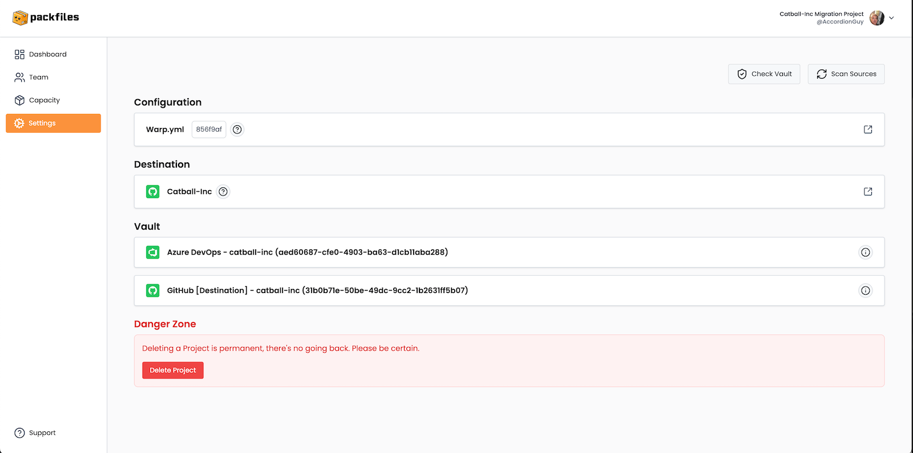

# Settings

<figure><figcaption></figcaption></figure>

The _Settings_ page is where you view the Project’s settings and configuration files, as well as perform tasks such as scanning the vault file, scanning the source organization for repositories, and deleting the Project.

The key parts of the _Dashboard_ page are described in detail below.

### Check Vault

<figure><figcaption></figcaption></figure>

The **Check Vault** button performs a test on your Project’s vault file, `config/vault.age`, to confirm that it contains the necessary data, namely:

* The personal access token for the Azure DevOps organization,
* The personal access token for the GitHub organization

When you click the **Check Vault** button, you’ll see this message...

<figure><figcaption></figcaption></figure>

...and when the process is complete, the results — information about the personal access tokens — will be displayed on the page’s _Vault_ section (see below for details).

### Scan Sources

<figure><figcaption></figcaption></figure>

The **Scan Sources** button starts the process of scanning the Azure DevOps organization for repositories.

When you click the **Scan Sources** button, you’ll see this message...

<figure><figcaption></figcaption></figure>

...and when the process is complete, the results will be visible in a couple of places:

* In the _Dashboard_ page’s _Trends_ section, under _Repositories Discovered_. If this is the first time you scanned sources, this value will now contain the number of repositories Warp found in the Azure DevOps organization. If this is  _not_ time, this value will be updated to reflect any repositories that have been added since the last scan.
* In the project’s _Migration HQ_ repository, where any repositories discovered since the last scan (or, if this is the first scan, all the repositories Warp was able to find) will be assigned an issue and appear as open issues on the _Issues_ page.

### Configuration

<figure><figcaption></figcaption></figure>

The _Configuration_ section shows information about the Project’s configuration files. It displays the following information:

* **Warp.yml.** The name of the project’s configuration file. You can view and edit this file in GitHub by clicking the  button on the right side of this section.
* **The partial hash of the Project’s vault file.** This is the first 7 characters of the SHA hash of the Project’s vault file, `config/vault.age`, which contains the encrypted personal access tokens for the Project’s Azure DevOps and GitHub organizations. You can view this file in GitHub by clicking that has.
* **The**  **button.** Displays a reminder that you can edit `warp.yml` in GitHub.

### Destination

<figure><figcaption></figcaption></figure>

The _Destination_ section shows the GitHub organization where this Project’s repositories are to be migrated. It displays the following for the organization:

* **The organization name.** In the example above, it’s **Hypotheticorp5678**.
* **The**  **button.** Displays a reminder that repositories from your sources will be migrated to this GitHub organization.
* **The**  **button.** Click this to open a new browser to the organization’s _Migration HQ_ repository.

### Vault

<figure><figcaption></figcaption></figure>

The _Vault_ section contains a list of the contents of the vault — the file containing the following personal access tokens that Warp uses to access the source and destination organizations in order to perform migrations.

Each item in this list represents a personal access token and contains the following:

* **The name of the token’s platform.** In the example above, the first token is for Azure DevOps and the second one is for GitHub.
* **The organization for which the token was issued.** In the example above, the first token is for the **joey-ado-testing** organization in Azure DevOps, and the second is for the **Hypotheticorp5678** organization in GitHub.
* **The unique identifier for the token.**
* **The**  **button.** Clicking this button displays a dialog box showing when the token was last checked using the **Check Vault** button:

<figure><figcaption></figcaption></figure>

### Danger Zone

<figure><figcaption></figcaption></figure>

The _Danger Zone_ contains a single control: the **Delete Project** button, which deletes the Project.

As a safety precaution, clicking the **Delete Project** button causes this dialog box to appear:

<figure><figcaption></figcaption></figure>

Clicking the **Confirm** button will permanently delete the project. Use this feature with caution!
