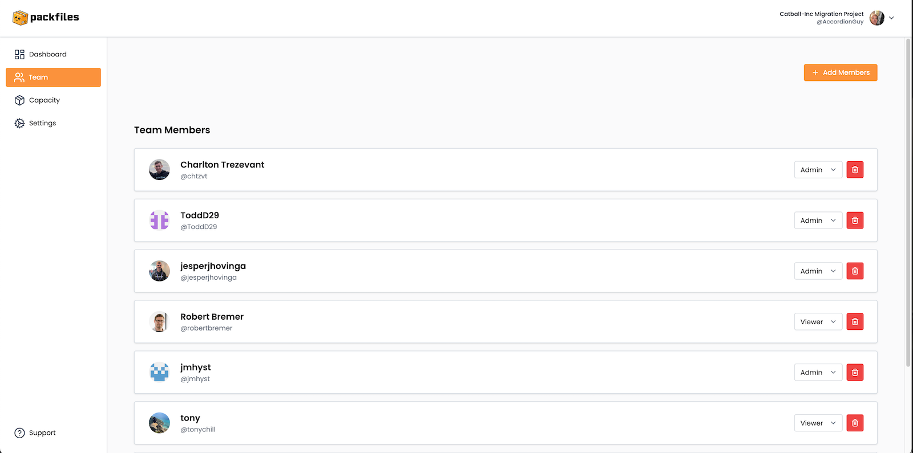

# Team

<figure><figcaption>
Warp’s <em>Team</em> page.
</figcaption></figure>

The _Team_ page is a list of the members of the _Team_ — the people authorized to have access to the project.

The key parts of the _Dashboard_ page are described in detail below.

### Add Members

<figure><figcaption></figcaption></figure>

The **Add Members** button starts the process of adding one or more people to the Team.&#x20;

Clicking the **Add Members** button opens this dialog:

<figure><figcaption></figcaption></figure>

To invite people to join your Team, you must provide the following information for each person:

* **Email address:** An email address for the person you’re inviting to join the Team. Warp will send an email invitation to this address.
* **Role:** The role that the person will have, if they join the Team. There are two roles, **Admin** and **Viewer**, and they have different permissions:

| Permission to...                                                    | Viewer | Admin |
| ------------------------------------------------------------------- | ------ | ----- |
| View reports                                                        | ✅      | ✅     |
| Manage Team members and roles                                       | ❌      | ✅     |
| Manage billing and licensing                                        | ❌      | ✅     |
| Manage connection of Warp to source environments                    | ❌      | ✅     |
| Delete projects                                                     | ❌      | ✅     |
| Get product support from Packfiles / migration support from partner | ✅      | ✅     |

You can invite multiple people by clicking the **+** button to add another invitee and the “trash can” button to remove an invitee:

<figure><figcaption></figcaption></figure>

After inviting someone to join the Team, the _Pending Redemption_ list will appear on the Team page, with a list item for each invitee:

<figure><figcaption></figcaption></figure>

Email invitations have a limited lifespan: they expire 7 days after they are sent.

The **...** button on the right side of each item in the _Pending Redemption_ list opens a menu containing one or two options:

<figure><figcaption></figcaption></figure>

* **Confirm:** This option appears only if the invitee has accepted the invitation. Select this item to confirm the addition of the invitee to the Team.
* **Discard:** This option is always available, whether or not the invitee has accepted the invitation.

An invitee who has accepted the invitation will be able to sign into Warp, but will not be able to view the Project until you have confirmed the addition of the invitee to the Team.

#### The Invitation Email

The email will come from **Packfiles Warp** and will inform the invitee that:

* They have been invited to collaborate on a specific project (the email will also specify the name of the Project), and
* They can accept the invitation by clicking on a link provided in the email.

When the invitee clicks on the link in their invitation email, they will be taken to GitHub, where they will be asked to authorize Warp to verify their GitHub identity, know which resources they can access, and act on their behalf:

<figure><figcaption></figcaption></figure>

If the invitee clicks the **Authorize Packfiles Warp** button and grants the authorizations shown above, this authorization, they are taken to the Warp web application, where they will be asked if they accept the Warp’s terms of use and privacy policy:

<figure><figcaption></figcaption></figure>

If the invitee clicks the **Accept** button, they will be redirected to the _Projects_ page.&#x20;

The invitee will have access to only those Projects for which their invitation has been confirmed by an **Admin**-level member. An invitee whose invitation has not yet been confirmed will still be able to sign into Warp, but will not be able to access any Projects.

### Team Members

<figure><figcaption></figcaption></figure>

The _Team Members_ list displays the members of the Team, providing the following information about each of them:

* Their GitHub icon
* Their name
* Their GitHub username

Each item in the list has controls on the right side that allow you to:

* **Change the member’s role.** To confirm the change, you must click the **Save Changes** button at the bottom of the list.
* **Remove the member from the Team.** You will be asked to confirm that you want to remove the member.
